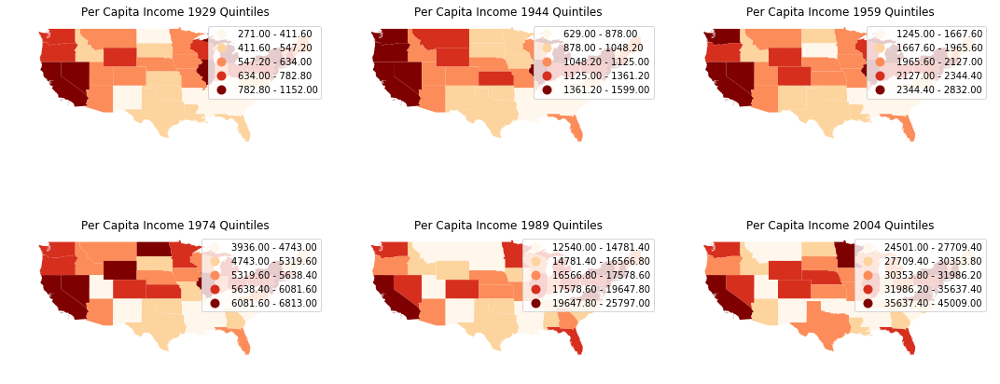
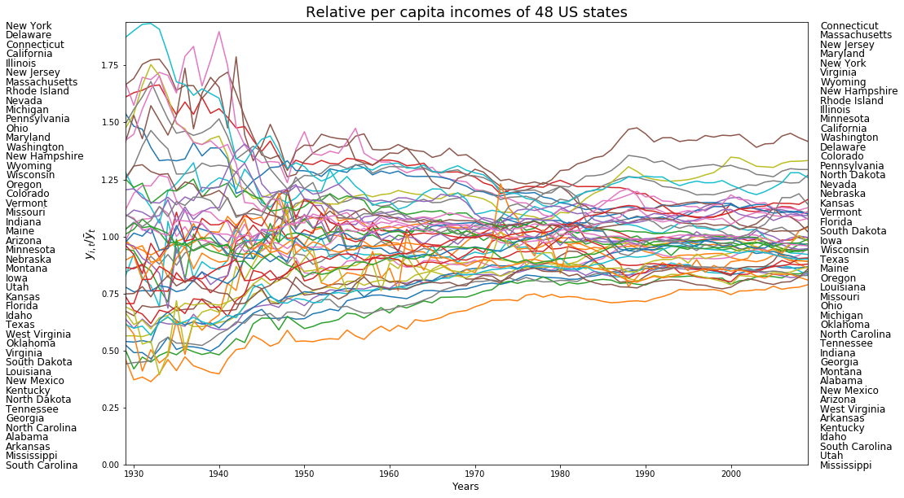
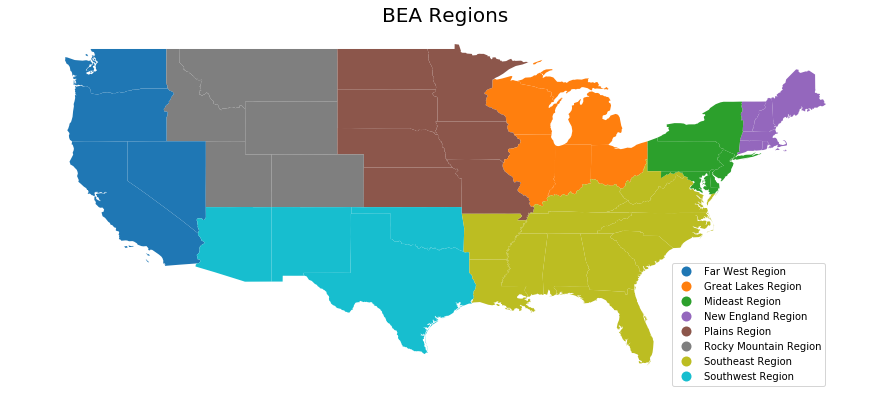
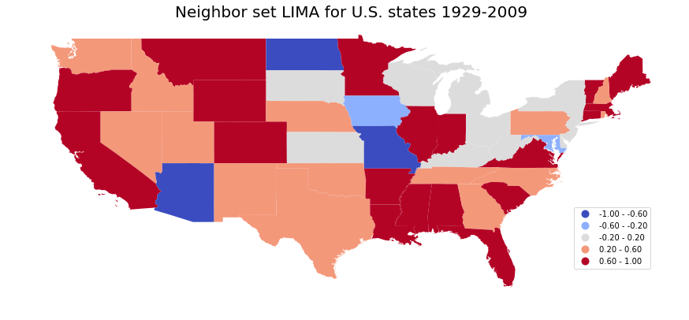
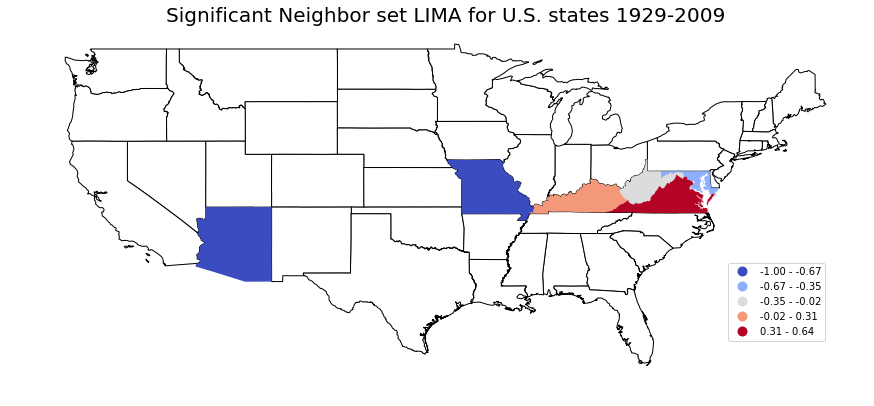
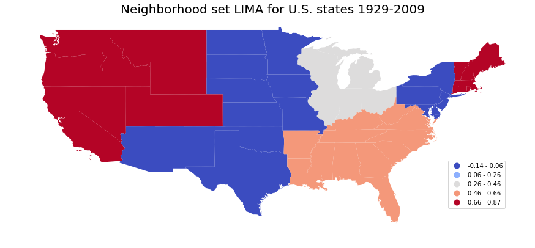
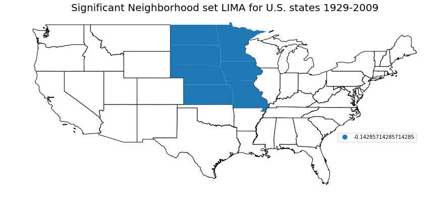

---
redirect_from:
  - "/dynamics/giddy/rank-based-methods"
interact_link: content/dynamics/giddy/Rank_based_Methods.ipynb
title: 'Rank_based_Methods'
prev_page:
  url: /dynamics/giddy/Mobility_measures
  title: 'Mobility_measures'
next_page:
  url: /dynamics/giddy/Rank_Markov
  title: 'Rank_Markov'
comment: "***PROGRAMMATICALLY GENERATED, DO NOT EDIT. SEE ORIGINAL FILES IN /content***"
---

# Rank based Methods

**Author: Wei Kang <weikang9009@gmail.com>, Serge Rey <sjsrey@gmail.com>**

## Introduction

This notebook introduces two classic nonparametric statistics of exchange mobility and their spatial extensions. We will demonstrate the usage of these methods by an empirical study for understanding [regional exchange mobility pattern in US](#Regional-exchange-mobility-pattern-in-US-1929-2009). The dataset is the per capita incomes observed annually from 1929 to 2010 for the lower 48 US states.

* [Kendall's $\tau$](#Kendall's-$\tau$)
    * Classic measures:
        * [Classic Kendall's $\tau$](#Classic-Kendall's-$\tau$)
        * [Local Kendall's $\tau$](#Local-Kendall's-$\tau$)
    * Spatial extensions:
        * [Spatial Kendall's $\tau$](#Spatial-Kendall's-$\tau$)
        * [Inter- and Intra-regional decomposition of Kendall's $\tau$](#Inter--and-Intra-regional-decomposition-of-Kendall's-$\tau$)
        * [Local indicator of mobility association-LIMA](#Local-indicator-of-mobility-association-LIMA)
* [$\Theta$ statistic of exchange mobility](#$\Theta$-statistic-of-exchange-mobility)

## Regional exchange mobility pattern in US 1929-2009

Firstly we load in the US dataset:


{:.input_area}
```python
import pandas as pd
import libpysal
import geopandas as gpd
import numpy as np

geo_table = gpd.read_file(libpysal.examples.get_path('us48.shp'))
income_table = pd.read_csv(libpysal.examples.get_path("usjoin.csv"))
complete_table = geo_table.merge(income_table,left_on='STATE_NAME',right_on='Name')
complete_table.head()
```


<div markdown="0">
<div>
<style scoped>
    .dataframe tbody tr th:only-of-type {
        vertical-align: middle;
    }

    .dataframe tbody tr th {
        vertical-align: top;
    }

    .dataframe thead th {
        text-align: right;
    }
</style>
<table border="1" class="dataframe">
  <thead>
    <tr style="text-align: right;">
      <th></th>
      <th>AREA</th>
      <th>PERIMETER</th>
      <th>STATE_</th>
      <th>STATE_ID</th>
      <th>STATE_NAME</th>
      <th>STATE_FIPS_x</th>
      <th>SUB_REGION</th>
      <th>STATE_ABBR</th>
      <th>geometry</th>
      <th>Name</th>
      <th>...</th>
      <th>2000</th>
      <th>2001</th>
      <th>2002</th>
      <th>2003</th>
      <th>2004</th>
      <th>2005</th>
      <th>2006</th>
      <th>2007</th>
      <th>2008</th>
      <th>2009</th>
    </tr>
  </thead>
  <tbody>
    <tr>
      <th>0</th>
      <td>20.750</td>
      <td>34.956</td>
      <td>1</td>
      <td>1</td>
      <td>Washington</td>
      <td>53</td>
      <td>Pacific</td>
      <td>WA</td>
      <td>(POLYGON ((-122.400749206543 48.22539520263672...</td>
      <td>Washington</td>
      <td>...</td>
      <td>31528</td>
      <td>32053</td>
      <td>32206</td>
      <td>32934</td>
      <td>34984</td>
      <td>35738</td>
      <td>38477</td>
      <td>40782</td>
      <td>41588</td>
      <td>40619</td>
    </tr>
    <tr>
      <th>1</th>
      <td>45.132</td>
      <td>34.527</td>
      <td>2</td>
      <td>2</td>
      <td>Montana</td>
      <td>30</td>
      <td>Mtn</td>
      <td>MT</td>
      <td>POLYGON ((-111.4746322631836 44.70223999023438...</td>
      <td>Montana</td>
      <td>...</td>
      <td>22569</td>
      <td>24342</td>
      <td>24699</td>
      <td>25963</td>
      <td>27517</td>
      <td>28987</td>
      <td>30942</td>
      <td>32625</td>
      <td>33293</td>
      <td>32699</td>
    </tr>
    <tr>
      <th>2</th>
      <td>9.571</td>
      <td>18.899</td>
      <td>3</td>
      <td>3</td>
      <td>Maine</td>
      <td>23</td>
      <td>N Eng</td>
      <td>ME</td>
      <td>(POLYGON ((-69.77778625488281 44.0740737915039...</td>
      <td>Maine</td>
      <td>...</td>
      <td>25623</td>
      <td>27068</td>
      <td>27731</td>
      <td>28727</td>
      <td>30201</td>
      <td>30721</td>
      <td>32340</td>
      <td>33620</td>
      <td>34906</td>
      <td>35268</td>
    </tr>
    <tr>
      <th>3</th>
      <td>21.874</td>
      <td>21.353</td>
      <td>4</td>
      <td>4</td>
      <td>North Dakota</td>
      <td>38</td>
      <td>W N Cen</td>
      <td>ND</td>
      <td>POLYGON ((-98.73005676269531 45.93829727172852...</td>
      <td>North Dakota</td>
      <td>...</td>
      <td>25068</td>
      <td>26118</td>
      <td>26770</td>
      <td>29109</td>
      <td>29676</td>
      <td>31644</td>
      <td>32856</td>
      <td>35882</td>
      <td>39009</td>
      <td>38672</td>
    </tr>
    <tr>
      <th>4</th>
      <td>22.598</td>
      <td>22.746</td>
      <td>5</td>
      <td>5</td>
      <td>South Dakota</td>
      <td>46</td>
      <td>W N Cen</td>
      <td>SD</td>
      <td>POLYGON ((-102.7879333496094 42.99532318115234...</td>
      <td>South Dakota</td>
      <td>...</td>
      <td>26115</td>
      <td>27531</td>
      <td>27727</td>
      <td>30072</td>
      <td>31765</td>
      <td>32726</td>
      <td>33320</td>
      <td>35998</td>
      <td>38188</td>
      <td>36499</td>
    </tr>
  </tbody>
</table>
<p>5 rows × 92 columns</p>
</div>
</div>


We will visualize the spatial distributions of per capita incomes of US states across 1929 to 2009 to obtain a first impression of the dynamics. 


{:.input_area}
```python
import matplotlib.pyplot as plt
%matplotlib inline

index_year = range(1929,2010,15)
fig, axes = plt.subplots(nrows=2, ncols=3,figsize = (15,7))
for i in range(2):
    for j in range(3):
        ax = axes[i,j]
        complete_table.plot(ax=ax, column=str(index_year[i*3+j]), cmap='OrRd', scheme='quantiles', legend=True)
        ax.set_title('Per Capita Income %s Quintiles'%str(index_year[i*3+j]))
        ax.axis('off')
plt.tight_layout()
```





{:.input_area}
```python
years = range(1929,2010)
names = income_table['Name']
pci = income_table.drop(['Name','STATE_FIPS'], 1).values.T
rpci= (pci.T / pci.mean(axis=1)).T
order1929 = np.argsort(rpci[0,:])
order2009 = np.argsort(rpci[-1,:])
names1929 = names[order1929[::-1]]
names2009 = names[order2009[::-1]]
first_last = np.vstack((names1929,names2009))
from pylab import rcParams
rcParams['figure.figsize'] = 15,10
p = plt.plot(years,rpci)
for i in range(48):
    plt.text(1915,1.91-(i*0.041), first_last[0][i],fontsize=12)
    plt.text(2010.5,1.91-(i*0.041), first_last[1][i],fontsize=12)
plt.xlim((years[0], years[-1]))
plt.ylim((0, 1.94))
plt.ylabel(r"$y_{i,t}/\bar{y}_t$",fontsize=14)
plt.xlabel('Years',fontsize=12)
plt.title('Relative per capita incomes of 48 US states',fontsize=18)
```


{:.output_data_text}
```
Text(0.5,1,'Relative per capita incomes of 48 US states')
```





The above figure displays the trajectories of relative per capita incomes of 48 US states. It is quite obvious that states were swapping positions across 1929-2009. We will demonstrate how to quantify the exchange mobility as well as how to assess the regional and local contribution to the overall exchange mobility. We will ultilize [BEA regions](https://www.bea.gov/regional/docs/regions.cfm) and base on it for constructing the block weight matrix. 

BEA regional scheme divide US states into 8 regions:
* New England Region
* Mideast Region
* Great Lakes Region
* Plains Region
* Southeast Region
* Southwest Region
* Rocky Mountain Region
* Far West Region

As the dataset does not contain information regarding BEA regions, we manually input the regional information:


{:.input_area}
```python
BEA_regions = ["New England Region","Mideast Region","Great Lakes Region","Plains Region","Southeast Region","Southwest Region","Rocky Mountain Region","Far West Region"]
BEA_regions_abbr = ["NENG","MEST","GLAK","PLNS","SEST","SWST","RKMT","FWST"]
BEA = pd.DataFrame({ 'Region code' : np.arange(1,9,1), 'BEA region' : BEA_regions,'BEA abbr':BEA_regions_abbr})
BEA
```


<div markdown="0">
<div>
<style scoped>
    .dataframe tbody tr th:only-of-type {
        vertical-align: middle;
    }

    .dataframe tbody tr th {
        vertical-align: top;
    }

    .dataframe thead th {
        text-align: right;
    }
</style>
<table border="1" class="dataframe">
  <thead>
    <tr style="text-align: right;">
      <th></th>
      <th>Region code</th>
      <th>BEA region</th>
      <th>BEA abbr</th>
    </tr>
  </thead>
  <tbody>
    <tr>
      <th>0</th>
      <td>1</td>
      <td>New England Region</td>
      <td>NENG</td>
    </tr>
    <tr>
      <th>1</th>
      <td>2</td>
      <td>Mideast Region</td>
      <td>MEST</td>
    </tr>
    <tr>
      <th>2</th>
      <td>3</td>
      <td>Great Lakes Region</td>
      <td>GLAK</td>
    </tr>
    <tr>
      <th>3</th>
      <td>4</td>
      <td>Plains Region</td>
      <td>PLNS</td>
    </tr>
    <tr>
      <th>4</th>
      <td>5</td>
      <td>Southeast Region</td>
      <td>SEST</td>
    </tr>
    <tr>
      <th>5</th>
      <td>6</td>
      <td>Southwest Region</td>
      <td>SWST</td>
    </tr>
    <tr>
      <th>6</th>
      <td>7</td>
      <td>Rocky Mountain Region</td>
      <td>RKMT</td>
    </tr>
    <tr>
      <th>7</th>
      <td>8</td>
      <td>Far West Region</td>
      <td>FWST</td>
    </tr>
  </tbody>
</table>
</div>
</div>


{:.input_area}
```python
region_code = list(np.repeat(1,6))+list(np.repeat(2,6))+list(np.repeat(3,5))+list(np.repeat(4,7))+list(np.repeat(5,12))+list(np.repeat(6,4))+list(np.repeat(7,5))+list(np.repeat(8,6))
state_code = ['09','23','25','33','44','50','10','11','24','34','36','42','17','18','26','39','55','19','20','27','29','31','38','46','01','05','12','13','21','22','28','37','45','47','51','54','04','35','40','48','08','16','30','49','56','02','06','15','32','41','53']
state_region = pd.DataFrame({'Region code':region_code,"State code":state_code})
state_region_all = state_region.merge(BEA,left_on='Region code',right_on='Region code')
complete_table = complete_table.merge(state_region_all,left_on='STATE_FIPS_x',right_on='State code')
complete_table.head()
```


<div markdown="0">
<div>
<style scoped>
    .dataframe tbody tr th:only-of-type {
        vertical-align: middle;
    }

    .dataframe tbody tr th {
        vertical-align: top;
    }

    .dataframe thead th {
        text-align: right;
    }
</style>
<table border="1" class="dataframe">
  <thead>
    <tr style="text-align: right;">
      <th></th>
      <th>AREA</th>
      <th>PERIMETER</th>
      <th>STATE_</th>
      <th>STATE_ID</th>
      <th>STATE_NAME</th>
      <th>STATE_FIPS_x</th>
      <th>SUB_REGION</th>
      <th>STATE_ABBR</th>
      <th>geometry</th>
      <th>Name</th>
      <th>...</th>
      <th>2004</th>
      <th>2005</th>
      <th>2006</th>
      <th>2007</th>
      <th>2008</th>
      <th>2009</th>
      <th>Region code</th>
      <th>State code</th>
      <th>BEA region</th>
      <th>BEA abbr</th>
    </tr>
  </thead>
  <tbody>
    <tr>
      <th>0</th>
      <td>20.750</td>
      <td>34.956</td>
      <td>1</td>
      <td>1</td>
      <td>Washington</td>
      <td>53</td>
      <td>Pacific</td>
      <td>WA</td>
      <td>(POLYGON ((-122.400749206543 48.22539520263672...</td>
      <td>Washington</td>
      <td>...</td>
      <td>34984</td>
      <td>35738</td>
      <td>38477</td>
      <td>40782</td>
      <td>41588</td>
      <td>40619</td>
      <td>8</td>
      <td>53</td>
      <td>Far West Region</td>
      <td>FWST</td>
    </tr>
    <tr>
      <th>1</th>
      <td>45.132</td>
      <td>34.527</td>
      <td>2</td>
      <td>2</td>
      <td>Montana</td>
      <td>30</td>
      <td>Mtn</td>
      <td>MT</td>
      <td>POLYGON ((-111.4746322631836 44.70223999023438...</td>
      <td>Montana</td>
      <td>...</td>
      <td>27517</td>
      <td>28987</td>
      <td>30942</td>
      <td>32625</td>
      <td>33293</td>
      <td>32699</td>
      <td>7</td>
      <td>30</td>
      <td>Rocky Mountain Region</td>
      <td>RKMT</td>
    </tr>
    <tr>
      <th>2</th>
      <td>9.571</td>
      <td>18.899</td>
      <td>3</td>
      <td>3</td>
      <td>Maine</td>
      <td>23</td>
      <td>N Eng</td>
      <td>ME</td>
      <td>(POLYGON ((-69.77778625488281 44.0740737915039...</td>
      <td>Maine</td>
      <td>...</td>
      <td>30201</td>
      <td>30721</td>
      <td>32340</td>
      <td>33620</td>
      <td>34906</td>
      <td>35268</td>
      <td>1</td>
      <td>23</td>
      <td>New England Region</td>
      <td>NENG</td>
    </tr>
    <tr>
      <th>3</th>
      <td>21.874</td>
      <td>21.353</td>
      <td>4</td>
      <td>4</td>
      <td>North Dakota</td>
      <td>38</td>
      <td>W N Cen</td>
      <td>ND</td>
      <td>POLYGON ((-98.73005676269531 45.93829727172852...</td>
      <td>North Dakota</td>
      <td>...</td>
      <td>29676</td>
      <td>31644</td>
      <td>32856</td>
      <td>35882</td>
      <td>39009</td>
      <td>38672</td>
      <td>4</td>
      <td>38</td>
      <td>Plains Region</td>
      <td>PLNS</td>
    </tr>
    <tr>
      <th>4</th>
      <td>22.598</td>
      <td>22.746</td>
      <td>5</td>
      <td>5</td>
      <td>South Dakota</td>
      <td>46</td>
      <td>W N Cen</td>
      <td>SD</td>
      <td>POLYGON ((-102.7879333496094 42.99532318115234...</td>
      <td>South Dakota</td>
      <td>...</td>
      <td>31765</td>
      <td>32726</td>
      <td>33320</td>
      <td>35998</td>
      <td>38188</td>
      <td>36499</td>
      <td>4</td>
      <td>46</td>
      <td>Plains Region</td>
      <td>PLNS</td>
    </tr>
  </tbody>
</table>
<p>5 rows × 96 columns</p>
</div>
</div>


The BEA regions are visualized below:


{:.input_area}
```python
fig, ax = plt.subplots(nrows=1, ncols=1,figsize = (15,8))
beaplot = complete_table.plot(ax=ax,column="BEA region", legend=True)
leg = ax.get_legend()
leg.set_bbox_to_anchor((0.8, 0.15, 0.16, 0.2))
beaplot.set_title("BEA Regions",fontdict={"fontsize":20})
ax.set_axis_off()
```





## Kendall's $\tau$

Kendall’s $\tau$ statistic is based on a comparison of the number of pairs of $n$ observations that have concordant ranks between two variables. For measuring exchange mobility in **giddy**, the two variables in question are the values of an attribute measured at two points in time over $n$ spatial units. This classic measure of rank correlation indicates how much relative stability there has been in the map pattern over the two periods. Spatial decomposition of Kendall’s $\tau$ could be classified into three spatial scales: global spatial decomposition , inter- and intra-regional decomposition and local spatial decomposition. More details will be given latter.

### Classic Kendall's $\tau$

Kendall's $\tau$ statistic is a global measure of exchange mobility. For $n$ spatial units over two periods, it is formally defined as follows:

$$\tau = \frac{c-d}{(n(n-1))/2}$$

where $c$ is the number of concordant pairs (two spatial units which do not exchange ranks over two periods), and $d$ is the number of discordant pairs (two spatial units which exchange ranks over two periods). $-1 \leq \tau \leq 1$. Smaller $\tau$ indicates higher exchange mobility.

In giddy, class $Tau$ requires two inputs: a cross-section of income values at one period ($x$) and a cross-section of income values at another period ($y$):

```python
giddy.rank.Tau(self, x, y)
```

We will construct a $Tau$ instance by specifying the incomes in two periods. Here, we look at the global exchange mobility of US states between 1929 and 2009.


{:.input_area}
```python
import giddy
```


{:.input_area}
```python
tau = giddy.rank.Tau(complete_table["1929"],complete_table["2009"])
tau
```


{:.output_data_text}
```
<giddy.rank.Tau at 0x1a2130cf60>
```


{:.input_area}
```python
tau.concordant
```


{:.output_data_text}
```
856.0
```


{:.input_area}
```python
tau.discordant
```


{:.output_data_text}
```
271.0
```


There are 856 concordant pairs of US states between 1929 and 2009, and 271 discordant pairs.


{:.input_area}
```python
tau.tau
```


{:.output_data_text}
```
0.5188470576690462
```


{:.input_area}
```python
tau.tau_p
```


{:.output_data_text}
```
1.9735720263920198e-07
```


The observed Kendall's $\tau$ statistic is 0.519 and its p-value is $1.974 \times 10^{-7}$. Therefore, we will reject the null hypothesis of no assocation between 1929 and 2009 at the $5\%$ significance level.

### Spatial Kendall's $\tau$

The spatial Kendall's $\tau$ decomposes all pairs into those that are spatial neighbors and those that are not, and examines whether the rank correlation is different between the two sets (Rey, 2014). 

$$\tau_w = \frac{\iota'(W\circ S)\iota}{\iota'W \iota}$$

$W$ is the spatial weight matrix, $S$ is the concordance matrix and $\iota$ is the $(n,1)$ unity vector. The null hypothesis is the spatial randomness of rank exchanges. The inference of $\tau_w$ could be conducted based on random spatial permutation of incomes at two periods. 

```python
giddy.rank.SpatialTau(self, x, y, w, permutations=0)
```
For illustration, we turn back to the case of incomes in US states over 1929-2009:


{:.input_area}
```python
from libpysal.weights import block_weights
w = block_weights(complete_table["BEA region"])
np.random.seed(12345)
tau_w = giddy.rank.SpatialTau(complete_table["1929"],complete_table["2009"],w,999) 
```


{:.input_area}
```python
tau_w.concordant
```


{:.output_data_text}
```
856.0
```


{:.input_area}
```python
tau_w.concordant_spatial
```


{:.output_data_text}
```
103
```


{:.input_area}
```python
tau_w.discordant
```


{:.output_data_text}
```
271.0
```


{:.input_area}
```python
tau_w.discordant_spatial
```


{:.output_data_text}
```
41
```


Out of 856 concordant pairs of spatial units, 103 belong to the same region (and are considered neighbors); out of 271 discordant pairs of spatial units, 41 belong to the same region.


{:.input_area}
```python
tau_w.tau_spatial
```


{:.output_data_text}
```
0.4305555555555556
```


{:.input_area}
```python
tau_w.tau_spatial_psim
```


{:.output_data_text}
```
0.001
```


The estimate of spatial Kendall's $\tau$ is 0.431 and its p-value is 0.001 which is much smaller than the significance level $0.05$. Therefore, we reject the null of spatial randomness of exchange mobility. The fact that $\tau_w=0.431$  is smaller than the global average $\tau=0.519$ implies that globally a significant number of rank exchanges happened between states within the same region though we do not know the specific region or regions hosting these rank exchanges. A more thorough decomposition of $\tau$ such as inter- and intra-regional indicators and local indicators will provide insights on this issue.

### Inter- and Intra-regional decomposition of Kendall's $\tau$

A meso-level view on the exchange mobility pattern is provided by inter- and intra-regional decomposition of Kendall's $\tau$. This decomposition can shed light on specific regions hosting most rank exchanges. More precisely, insteading of examining the concordance relationship between any two neighboring spatial units in the whole study area, for a specific region A, we examine the concordance relationship between any two spatial units within region A (neighbors), resulting in the intraregional concordance statistic for A; or we could examine the concordance relationship between any spatial unit in region A and any spatial unit in region B (nonneighbors), resulting in the interregional concordance statistic for A and B. If there are k regions, there will be k intraregional concordance statistics and $(k-1)^2$ interregional concordance statistics, we could organize them into a $(k,k)$ matrix where the diagonal elements are intraregional concordance statistics and nondiagnoal elements are interregional concordance statistics.

Formally, this inter- and intra-regional concordance statistic matrix is defined as follows (Rey, 2016):

$$T=\frac{P(H \circ S)P'}{P H P'}$$

$P$ is a $(k,n)$ binary matrix where $p_{j,i}=1$ if spatial unit $i$ is in region $j$ and $p_{j,i}=0$ otherwise. $H$ is a $(n,n)$ matrix with 0 on diagnoal and 1 on other places. $\circ$ is the Hadamard product. Inference could be based on random spatial permutation of incomes at two periods, similar to spatial $\tau$. 

To obtain an estimate for the inter- and intra-regional indicator matrix, we use the $Tau\_Regional$ class:
```python
giddy.rank.Tau_Regional(self, x, y, regime, permutations=0)
```
Here, $regime$ is an 1-dimensional array of size n. Each element is the id of which region an spatial unit belongs to.


{:.input_area}
```python
giddy.rank.Tau_Regional?
```


Similar to before, we go back to the case of incomes in US states over 1929-2009:


{:.input_area}
```python
np.random.seed(12345)
tau_w = giddy.rank.Tau_Regional(complete_table["1929"],complete_table["2009"],complete_table["BEA region"],999) 
tau_w
```


{:.output_data_text}
```
<giddy.rank.Tau_Regional at 0x1a212d85c0>
```


{:.input_area}
```python
tau_w.tau_reg
```


{:.output_data_text}
```
array([[ 0.66666667,  0.5       ,  0.3       ,  0.41666667,  0.28571429,
         0.5       ,  0.79166667,  0.875     ],
       [ 0.5       ,  0.4       ,  0.52      ,  0.26666667, -0.48571429,
         0.52      ,  0.53333333,  0.6       ],
       [ 0.3       ,  0.52      ,  0.        ,  0.4       ,  0.88571429,
         0.76      ,  0.93333333,  1.        ],
       [ 0.41666667,  0.26666667,  0.4       ,  0.86666667,  0.47619048,
         0.83333333,  0.86111111,  0.91666667],
       [ 0.28571429, -0.48571429,  0.88571429,  0.47619048, -0.14285714,
         0.42857143,  0.69047619,  0.14285714],
       [ 0.5       ,  0.52      ,  0.76      ,  0.83333333,  0.42857143,
         0.8       ,  0.06666667,  0.1       ],
       [ 0.79166667,  0.53333333,  0.93333333,  0.86111111,  0.69047619,
         0.06666667,  0.54545455,  0.33333333],
       [ 0.875     ,  0.6       ,  1.        ,  0.91666667,  0.14285714,
         0.1       ,  0.33333333,  0.        ]])
```


The attribute $tau\_reg$ gives the inter- and intra-regional concordance statistic matrix. Higher values represents lower exchange mobility. Obviously there are some negative values indicating high exchange mobility. Attribute $tau\_reg\_pvalues$ gives pvalues for all inter- and intra-regional concordance statistics: 


{:.input_area}
```python
tau_w.tau_reg_pvalues
```


{:.output_data_text}
```
array([[0.586, 0.516, 0.196, 0.37 , 0.151, 0.526, 0.051, 0.104],
       [0.516, 0.41 , 0.583, 0.114, 0.001, 0.532, 0.526, 0.472],
       [0.196, 0.583, 0.102, 0.316, 0.011, 0.156, 0.001, 0.014],
       [0.37 , 0.114, 0.316, 0.122, 0.41 , 0.034, 0.003, 0.026],
       [0.151, 0.001, 0.011, 0.41 , 0.013, 0.344, 0.08 , 0.051],
       [0.526, 0.532, 0.156, 0.034, 0.344, 0.324, 0.005, 0.056],
       [0.051, 0.526, 0.001, 0.003, 0.08 , 0.005, 0.502, 0.136],
       [0.104, 0.472, 0.014, 0.026, 0.051, 0.056, 0.136, 0.166]])
```


We can manipulate these two attribute to obtain significant inter- and intra-regional statistics only (at the $5\%$ significance level):


{:.input_area}
```python
tau_w.tau_reg * (tau_w.tau_reg_pvalues<0.05)
```


{:.output_data_text}
```
array([[ 0.        ,  0.        ,  0.        ,  0.        ,  0.        ,
         0.        ,  0.        ,  0.        ],
       [ 0.        ,  0.        ,  0.        ,  0.        , -0.48571429,
         0.        ,  0.        ,  0.        ],
       [ 0.        ,  0.        ,  0.        ,  0.        ,  0.88571429,
         0.        ,  0.93333333,  1.        ],
       [ 0.        ,  0.        ,  0.        ,  0.        ,  0.        ,
         0.83333333,  0.86111111,  0.91666667],
       [ 0.        , -0.48571429,  0.88571429,  0.        , -0.14285714,
         0.        ,  0.        ,  0.        ],
       [ 0.        ,  0.        ,  0.        ,  0.83333333,  0.        ,
         0.        ,  0.06666667,  0.        ],
       [ 0.        ,  0.        ,  0.93333333,  0.86111111,  0.        ,
         0.06666667,  0.        ,  0.        ],
       [ 0.        ,  0.        ,  1.        ,  0.91666667,  0.        ,
         0.        ,  0.        ,  0.        ]])
```


The table below displays the inter- and intra-regional decomposition matrix of Kendall's $\tau$ for US states over 1929-2009 based on the 8 BEA regions. Bold numbers indicate significance at the $5\%$ significance level. The negative and significant intra-Southeast concordance statistic ($-0.486$) indicates that the rank exchanges within Southeast region is significantly more frequent than those between states within and out of Southeast region.

| Region        | New England| Mideast|Great Lakes|Plains|Southeast|Southwest|Rocky Mountain|Far West|
|:-------------:|:-------------:|:-----:|:-----:|:-----:|:-----:|:-----:|:-----:|:-----:|
| New England  | 0.667|  0.5 | 0.3|0.417|  0.2856|0.5 | 0.792|  0.875|
| Mideast      | 0.5 |  0.4|0.52|0.267| **-0.486**|0.52| 0.533| 0.6 |
| Great Lakes |  0.3 |  0.52 |  0  |  0.4 |  **0.886**| 0.76 | **0.933**|1.|
|Plains| 0.417| 0.267|  0.4 |  0.867|  0.476|**0.833**| **0.861**| **0.917**|
|Southeast|0.286|**-0.486**|**0.886**| 0.476| **-0.143**|0.429| 0.690| 0.143|
|Southwest| 0.5 |0.52 |0.76|**0.833**| 0.429|0.8|**0.067**|0.1|
|Rocky Mountain|0.792| 0.533| **0.933**|**0.861**| 0.69|**0.067**| 0.545|0.333|
|Far West|0.875|0.6| 1.| **0.917**|0.143|0.1 |0.333| 0|

### Local Kendall's $\tau$

Local Kendall's $\tau$ is a local decomposition of classic Kendall's $\tau$ which provides an indication of the contribution of spatial unit $r$’s rank changes to the overall level of exchange mobility (Rey, 2016). Focusing on spatial unit $r$, we formally define it as follows:
$$\tau_{r} = \frac{c_r - d_r}{n-1}$$

where $c_r$ is the number of spatial units (except $r$) which are concordant with $r$ and $d_r$ is the number of spatial units which are discordant with $r$. Similar to classic Kendall's $\tau$, local $\tau$ takes values on $[-1,1]$. The larger the value, the lower the exchange mobility for $r$.

```python
giddy.rank.Tau_Local(self, x, y)
```

We create a $Tau\_Local$ instance for US dynamics 1929-2009:


{:.input_area}
```python
tau_r = giddy.rank.Tau_Local(complete_table["1929"],complete_table["2009"])
tau_r
```


{:.output_data_text}
```
<giddy.rank.Tau_Local at 0x1141187b8>
```


{:.input_area}
```python
pd.DataFrame({"STATE_NAME":complete_table['STATE_NAME'].tolist(),"$\\tau_r$":tau_r.tau_local}).head()
```


<div markdown="0">
<div>
<style scoped>
    .dataframe tbody tr th:only-of-type {
        vertical-align: middle;
    }

    .dataframe tbody tr th {
        vertical-align: top;
    }

    .dataframe thead th {
        text-align: right;
    }
</style>
<table border="1" class="dataframe">
  <thead>
    <tr style="text-align: right;">
      <th></th>
      <th>STATE_NAME</th>
      <th>$\tau_r$</th>
    </tr>
  </thead>
  <tbody>
    <tr>
      <th>0</th>
      <td>Washington</td>
      <td>0.617021</td>
    </tr>
    <tr>
      <th>1</th>
      <td>Montana</td>
      <td>0.446809</td>
    </tr>
    <tr>
      <th>2</th>
      <td>Maine</td>
      <td>0.404255</td>
    </tr>
    <tr>
      <th>3</th>
      <td>North Dakota</td>
      <td>-0.021277</td>
    </tr>
    <tr>
      <th>4</th>
      <td>South Dakota</td>
      <td>0.319149</td>
    </tr>
  </tbody>
</table>
</div>
</div>


Therefore, local concordance measure produces a negative value for North Dakota (-0.0213) indicating that North Dakota exchanged ranks with a lot of states across 1929-2000. On the contrary, the local $\tau$ statistic is quite high for Washington (0.617) highlighting a high stability of Washington.

### Local indicator of mobility association-LIMA

To reveal the role of space in shaping the exchange mobility pattern for each spatial unit, two spatial variants of local Kendall's $\tau$ could be utilized: neighbor set LIMA and neighborhood set LIMA (Rey, 2016). The latter is also the result of a decomposition of local Kendall's $\tau$ (into neighboring and nonneighboring parts) as well as a decompostion of spatial Kendall's $\tau$ (into its local components).

#### Neighbor set LIMA

Instead of examining the concordance relationship between a focal spatial unit $r$ and all the other units as what local $\tau$ does, neighbor set LIMA focuses on the concordance relationship between a focal spatial unit $r$ and its neighbors only. It is formally defined as follows:

$$\tilde{\tau}_{r} = \frac{\sum_b w_{r,b} s_{r,b}}{\sum_b w_{r,b}}$$

```python
giddy.rank.Tau_Local_Neighbor(self, x, y, w, permutations=0)
```


{:.input_area}
```python
tau_wr = giddy.rank.Tau_Local_Neighbor(complete_table["1929"],complete_table["2009"],w,999) 
tau_wr
```


{:.output_data_text}
```
<giddy.rank.Tau_Local_Neighbor at 0x114118f98>
```


{:.input_area}
```python
tau_wr.tau_ln
```


{:.output_data_text}
```
array([ 0.33333333,  1.        ,  1.        , -0.66666667,  0.        ,
        1.        ,  0.        ,  0.5       ,  1.        ,  0.66666667,
        1.        ,  0.6       , -0.33333333,  1.        ,  0.33333333,
        0.        ,  0.5       ,  1.        ,  0.6       ,  0.        ,
        1.        ,  0.33333333,  0.5       ,  1.        ,  0.        ,
        1.        ,  0.        , -0.09090909, -0.5       ,  1.        ,
        0.09090909,  0.        ,  0.63636364, -1.        , -1.        ,
        0.33333333,  0.27272727,  0.45454545,  0.33333333,  0.33333333,
        0.63636364,  0.81818182,  0.45454545,  0.81818182,  0.81818182,
        0.81818182,  0.81818182,  0.        ])
```


To visualize the spatial distribution of neighbor set LIMA:


{:.input_area}
```python
complete_table["tau_ln"] =tau_wr.tau_ln
fig, ax = plt.subplots(nrows=1, ncols=1,figsize = (15,8))
ln_map = complete_table.plot(ax=ax, column="tau_ln", cmap='coolwarm', scheme='equal_interval',legend=True)
leg = ax.get_legend()
leg.set_bbox_to_anchor((0.8, 0.15, 0.16, 0.2))
ln_map.set_title("Neighbor set LIMA for U.S. states 1929-2009",fontdict={"fontsize":20})
ax.set_axis_off()
```





Therefore, Arizona, North Dakota, and Missouri exchanged ranks with most of their neighbors over 1929-2009 while California, Virginia etc. barely exchanged ranks with their neighbors.

Let see whether neighbor set LIMA statistics are siginificant for these "extreme" states:


{:.input_area}
```python
tau_wr.tau_ln_pvalues
```


{:.output_data_text}
```
array([0.463, 0.256, 0.165, 0.101, 0.316, 0.336, 0.237, 0.614, 0.292,
       0.325, 0.33 , 0.675, 0.06 , 0.541, 0.412, 0.032, 0.594, 0.791,
       0.575, 0.049, 0.209, 0.48 , 0.488, 0.457, 0.605, 0.409, 0.259,
       0.018, 0.022, 0.405, 0.016, 0.25 , 0.001, 0.001, 0.045, 0.521,
       0.167, 0.363, 0.635, 0.478, 0.417, 0.247, 0.282, 0.423, 0.578,
       0.17 , 0.1  , 0.625])
```


{:.input_area}
```python
sig_wr = tau_wr.tau_ln * (tau_wr.tau_ln_pvalues<0.05)
sig_wr
```


{:.output_data_text}
```
array([ 0.        ,  0.        ,  0.        , -0.        ,  0.        ,
        0.        ,  0.        ,  0.        ,  0.        ,  0.        ,
        0.        ,  0.        , -0.        ,  0.        ,  0.        ,
        0.        ,  0.        ,  0.        ,  0.        ,  0.        ,
        0.        ,  0.        ,  0.        ,  0.        ,  0.        ,
        0.        ,  0.        , -0.09090909, -0.5       ,  0.        ,
        0.09090909,  0.        ,  0.63636364, -1.        , -1.        ,
        0.        ,  0.        ,  0.        ,  0.        ,  0.        ,
        0.        ,  0.        ,  0.        ,  0.        ,  0.        ,
        0.        ,  0.        ,  0.        ])
```


{:.input_area}
```python
complete_table["sig_wr"] =sig_wr
fig, ax = plt.subplots(nrows=1, ncols=1,figsize = (15,8))
complete_table[complete_table["sig_wr"] == 0].plot(ax=ax, color='white',edgecolor='black')
sig_ln_map = complete_table[complete_table["sig_wr"] != 0].plot(ax=ax,column="sig_wr",cmap='coolwarm',scheme='equal_interval',legend=True)
leg = ax.get_legend()
leg.set_bbox_to_anchor((0.8, 0.15, 0.16, 0.2))
sig_ln_map.set_title("Significant Neighbor set LIMA for U.S. states 1929-2009",fontdict={"fontsize":20})
ax.set_axis_off()
```





Thus, Arizona and Missouri have significant and negative neighbor set LIMA values, and can be considered as hotspots of rank exchanges. This means that Arizona (or Missouri) tended to exchange ranks with its neighbors than with others over 1929-2009. On the contrary, Virgina has significant and large positive neighbor set LIMA value indicating that it tended to exchange ranks with its nonneighbors than with neighbors.

#### Neighborhood set LIMA

Neighborhood set LIMA extends neighbor set LIMA $\tilde{\tau}_{r}$ to consider the concordance relationships between any two spatial units in the subset which is composed of the focal unit $r$ and its neighbors.

```python
giddy.rank.Tau_Local_Neighborhood(self, x, y, w, permutations=0)
```


{:.input_area}
```python
tau_wwr = giddy.rank.Tau_Local_Neighborhood(complete_table["1929"],complete_table["2009"],w,999) 
tau_wwr
```


{:.output_data_text}
```
<giddy.rank.Tau_Local_Neighborhood at 0x114118f28>
```


{:.input_area}
```python
tau_wwr.tau_lnhood
```


{:.output_data_text}
```
array([ 0.66666667,  0.8       ,  0.86666667, -0.14285714, -0.14285714,
        0.8       ,  0.4       ,  0.8       ,  0.86666667, -0.14285714,
        0.66666667,  0.86666667, -0.14285714,  0.86666667, -0.14285714,
        0.        ,  0.        ,  0.86666667,  0.86666667,  0.        ,
        0.4       ,  0.66666667,  0.8       ,  0.66666667,  0.4       ,
        0.4       ,  0.        ,  0.54545455,  0.        ,  0.8       ,
        0.54545455, -0.14285714,  0.54545455, -0.14285714,  0.        ,
        0.        ,  0.54545455,  0.54545455,  0.        ,  0.        ,
        0.54545455,  0.54545455,  0.54545455,  0.54545455,  0.54545455,
        0.54545455,  0.54545455,  0.4       ])
```


{:.input_area}
```python
complete_table["tau_lnhood"] =tau_wwr.tau_lnhood
fig, ax = plt.subplots(nrows=1, ncols=1,figsize = (15,8))
ln_map = complete_table.plot(ax=ax, column="tau_lnhood", cmap='coolwarm', scheme='equal_interval',legend=True)
leg = ax.get_legend()
leg.set_bbox_to_anchor((0.8, 0.15, 0.16, 0.2))
ln_map.set_title("Neighborhood set LIMA for U.S. states 1929-2009",fontdict={"fontsize":20})
ax.set_axis_off()
```





{:.input_area}
```python
tau_wwr.tau_lnhood_pvalues
```


{:.output_data_text}
```
array([0.585, 0.278, 0.104, 0.032, 0.024, 0.295, 0.43 , 0.225, 0.167,
       0.02 , 0.548, 0.116, 0.023, 0.158, 0.017, 0.016, 0.075, 0.225,
       0.168, 0.027, 0.505, 0.66 , 0.146, 0.605, 0.614, 0.37 , 0.08 ,
       0.505, 0.059, 0.358, 0.541, 0.025, 0.185, 0.017, 0.225, 0.151,
       0.541, 0.527, 0.191, 0.12 , 0.519, 0.427, 0.526, 0.442, 0.453,
       0.528, 0.478, 0.617])
```


{:.input_area}
```python
sig_lnhood = tau_wwr.tau_lnhood * (tau_wwr.tau_lnhood_pvalues<0.05)
sig_lnhood
```


{:.output_data_text}
```
array([ 0.        ,  0.        ,  0.        , -0.14285714, -0.14285714,
        0.        ,  0.        ,  0.        ,  0.        , -0.14285714,
        0.        ,  0.        , -0.14285714,  0.        , -0.14285714,
        0.        ,  0.        ,  0.        ,  0.        ,  0.        ,
        0.        ,  0.        ,  0.        ,  0.        ,  0.        ,
        0.        ,  0.        ,  0.        ,  0.        ,  0.        ,
        0.        , -0.14285714,  0.        , -0.14285714,  0.        ,
        0.        ,  0.        ,  0.        ,  0.        ,  0.        ,
        0.        ,  0.        ,  0.        ,  0.        ,  0.        ,
        0.        ,  0.        ,  0.        ])
```


{:.input_area}
```python
complete_table["sig_lnhood"] =sig_lnhood
fig, ax = plt.subplots(nrows=1, ncols=1,figsize = (15,8))
complete_table[complete_table["sig_lnhood"] == 0].plot(ax=ax, color='white',edgecolor='black')
sig_ln_map = complete_table[complete_table["sig_lnhood"] != 0].plot(ax=ax,column="sig_lnhood",categorical=True,legend=True)
leg = ax.get_legend()
leg.set_bbox_to_anchor((0.8, 0.15, 0.16, 0.2))
sig_ln_map.set_title("Significant Neighborhood set LIMA for U.S. states 1929-2009",fontdict={"fontsize":20})
ax.set_axis_off()
```





## $\Theta$ statistic of exchange mobility

## Next steps

* theta statistic

## References
* Rey, Sergio J., and Myrna L. Sastré-Gutiérrez. 2010. “[Interregional Inequality Dynamics in Mexico](http://www.tandfonline.com/doi/abs/10.1080/17421772.2010.493955).” Spatial Economic Analysis 5 (3). Taylor & Francis: 277–98.
* Rey, Sergio J. 2014. “[Fast Algorithms for a Space-Time Concordance Measure](https://link.springer.com/article/10.1007/s00180-013-0461-2).” Computational Statistics 29 (3-4). Springer: 799–811.
* Rey, Sergio J. 2016. “[Space--Time Patterns of Rank Concordance: Local Indicators of Mobility Association with Application to Spatial Income Inequality Dynamics](http://www.tandfonline.com/doi/abs/10.1080/24694452.2016.1151336?journalCode=raag21).” Annals of the Association of American Geographers. Association of American Geographers 106 (4): 788–803.
