# Centrography of Point Patterns

**Authors: Serge Rey <sjsrey@gmail.com> and Wei Kang <weikang9009@gmail.com>**

## Introduction

Centrography refers to a set of descriptive statistics that provide summary descriptions of point patterns.

This notebook introduces three types of centrography analysis for point patterns in pysal.
* [Central Tendency](#Central-Tendency)
* [Dispersion and Orientation](#Dispersion-and-Orientation)
* [Shape Analysis](#Shape-Analysis)

We also illustrate centrography analysis using two simulated datasets. See [Another Example](#Another-Example)


The python file **centrography.py** contains several functions with which we can conduct centrography analysis.
* Central Tendency
    1. mean_center: calculate the mean center of the unmarked point pattern.
    2. weighted_mean_center: calculate the weighted mean center of the marked point pattern.
    3. manhattan_median: calculate the manhattan median
    4. euclidean_median: calculate the Euclidean median
* Dispersion and Orientation
    1. std_distance: calculate the standard distance
* Shape Analysis
    1. hull: calculate the convex hull of the point pattern
    2. mbr: calculate the minimum bounding box (rectangle)
    
All of the above functions operate on a series of coordinate pairs. That is, the data type of the first argument should be $(n,2)$ array_like. In case that you have a point pattern (PointPattern instance), you need to pass its attribute "points" instead of itself to these functions.


<div markdown="1" class="cell code_cell">
<div class="input_area" markdown="1">
```python
import numpy as np
from pysal.explore.pointpats import PointPattern
%matplotlib inline
import matplotlib.pyplot as plt
points = [[66.22, 32.54], [22.52, 22.39], [31.01, 81.21],
          [9.47, 31.02],  [30.78, 60.10], [75.21, 58.93],
          [79.26,  7.68], [8.23, 39.93],  [98.73, 77.17],
          [89.78, 42.53], [65.19, 92.08], [54.46, 8.48]]
pp = PointPattern(points) #create a point pattern "pp" from list
pp.points 

```
</div>

<div class="output_wrapper" markdown="1">
<div class="output_subarea" markdown="1">


<div markdown="0" class="output output_html">
<div>
<style scoped>
    .dataframe tbody tr th:only-of-type {
        vertical-align: middle;
    }

    .dataframe tbody tr th {
        vertical-align: top;
    }

    .dataframe thead th {
        text-align: right;
    }
</style>
<table border="1" class="dataframe">
  <thead>
    <tr style="text-align: right;">
      <th></th>
      <th>x</th>
      <th>y</th>
    </tr>
  </thead>
  <tbody>
    <tr>
      <th>0</th>
      <td>66.22</td>
      <td>32.54</td>
    </tr>
    <tr>
      <th>1</th>
      <td>22.52</td>
      <td>22.39</td>
    </tr>
    <tr>
      <th>2</th>
      <td>31.01</td>
      <td>81.21</td>
    </tr>
    <tr>
      <th>3</th>
      <td>9.47</td>
      <td>31.02</td>
    </tr>
    <tr>
      <th>4</th>
      <td>30.78</td>
      <td>60.10</td>
    </tr>
    <tr>
      <th>5</th>
      <td>75.21</td>
      <td>58.93</td>
    </tr>
    <tr>
      <th>6</th>
      <td>79.26</td>
      <td>7.68</td>
    </tr>
    <tr>
      <th>7</th>
      <td>8.23</td>
      <td>39.93</td>
    </tr>
    <tr>
      <th>8</th>
      <td>98.73</td>
      <td>77.17</td>
    </tr>
    <tr>
      <th>9</th>
      <td>89.78</td>
      <td>42.53</td>
    </tr>
    <tr>
      <th>10</th>
      <td>65.19</td>
      <td>92.08</td>
    </tr>
    <tr>
      <th>11</th>
      <td>54.46</td>
      <td>8.48</td>
    </tr>
  </tbody>
</table>
</div>
</div>


</div>
</div>
</div>


<div markdown="1" class="cell code_cell">
<div class="input_area" markdown="1">
```python
type(pp.points)

```
</div>

<div class="output_wrapper" markdown="1">
<div class="output_subarea" markdown="1">


{:.output_data_text}
```
pandas.core.frame.DataFrame
```


</div>
</div>
</div>


We can use PointPattern class method **plot** to visualize **pp**.


<div markdown="1" class="cell code_cell">
<div class="input_area" markdown="1">
```python
pp.plot()

```
</div>

<div class="output_wrapper" markdown="1">
<div class="output_subarea" markdown="1">

{:.output_png}
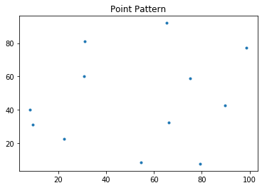

</div>
</div>
</div>


<div markdown="1" class="cell code_cell">
<div class="input_area" markdown="1">
```python
#import centragraphy analysis functions 
from pysal.explore.pointpats.centrography import hull, mbr, mean_center, weighted_mean_center, manhattan_median, std_distance,euclidean_median,ellipse

```
</div>

</div>


## Central Tendency

Central Tendency concerns about the center point of the two-dimensional distribution. It is similar to the first moment of a one-dimensional distribution. There are several ways to measure central tendency, each having pros and cons. We need to carefully select the appropriate measure according to our objective and data status.

### Mean Center $(x_{mc},y_{mc})$

$$x_{mc}=\frac{1}{n} \sum^n_{i=1}x_i$$
$$y_{mc}=\frac{1}{n} \sum^n_{i=1}y_i$$


<div markdown="1" class="cell code_cell">
<div class="input_area" markdown="1">
```python
mc = mean_center(pp.points)
mc

```
</div>

<div class="output_wrapper" markdown="1">
<div class="output_subarea" markdown="1">


{:.output_data_text}
```
array([52.57166667, 46.17166667])
```


</div>
</div>
</div>


<div markdown="1" class="cell code_cell">
<div class="input_area" markdown="1">
```python
pp.plot()
plt.plot(mc[0], mc[1], 'b^', label='Mean Center')
plt.legend(numpoints=1)

```
</div>

<div class="output_wrapper" markdown="1">
<div class="output_subarea" markdown="1">


{:.output_data_text}
```
<matplotlib.legend.Legend at 0x7f55e52433c8>
```


</div>
</div>
<div class="output_wrapper" markdown="1">
<div class="output_subarea" markdown="1">

{:.output_png}
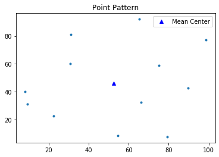

</div>
</div>
</div>


### Weighted Mean Center $(x_{wmc},y_{wmc})$

$$x_{wmc}=\sum^n_{i=1} \frac{w_i x_i}{\sum^n_{i=1}w_i}$$
$$y_{wmc}=\sum^n_{i=1} \frac{w_i y_i}{\sum^n_{i=1}w_i}$$

Weighted mean center is meant for marked point patterns. Aside from the first argument which is a seris of $(x,y)$ coordinates in **weighted_mean_center** function, we need to specify its second argument which is the weight for each event point.


<div markdown="1" class="cell code_cell">
<div class="input_area" markdown="1">
```python
weights = np.arange(12)
weights

```
</div>

<div class="output_wrapper" markdown="1">
<div class="output_subarea" markdown="1">


{:.output_data_text}
```
array([ 0,  1,  2,  3,  4,  5,  6,  7,  8,  9, 10, 11])
```


</div>
</div>
</div>


<div markdown="1" class="cell code_cell">
<div class="input_area" markdown="1">
```python
wmc = weighted_mean_center(pp.points, weights)
wmc

```
</div>

<div class="output_wrapper" markdown="1">
<div class="output_subarea" markdown="1">


{:.output_data_text}
```
array([60.51681818, 47.76848485])
```


</div>
</div>
</div>


<div markdown="1" class="cell code_cell">
<div class="input_area" markdown="1">
```python
pp.plot() #use class method "plot" to visualize point pattern
plt.plot(mc[0], mc[1], 'b^', label='Mean Center') 
plt.plot(wmc[0], wmc[1], 'gd', label='Weighted Mean Center')
plt.legend(numpoints=1)

```
</div>

<div class="output_wrapper" markdown="1">
<div class="output_subarea" markdown="1">


{:.output_data_text}
```
<matplotlib.legend.Legend at 0x7f55e51b3d30>
```


</div>
</div>
<div class="output_wrapper" markdown="1">
<div class="output_subarea" markdown="1">

{:.output_png}
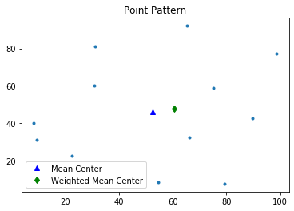

</div>
</div>
</div>


### Manhattan Median $(x_{mm},y_{mm})$

$$min  f(x_{mm},y_{mm})= \sum^n_{i=1}(|x_i-x_{mm}|+|y_i-y_{mm}|)$$

The Manhattan median is the location which minimizes the absolute distance to all the event points. It is an extension of the median measure in one-dimensional space to two-dimensional space. Since in one-dimensional space, a median is the number separating the higher half of a dataset from the lower half, we define the Manhattan median as a tuple whose first element is the median of $x$ coordinates and second element is the median of $y$ coordinates.

Though Manhattan median can be found very quickly, it is not unique if you have even number of points. In this case, pysal handles the Manhattan median the same way as numpy.median: return the average of the two middle values.


<div markdown="1" class="cell code_cell">
<div class="input_area" markdown="1">
```python
#get the number of points in point pattern "pp"
pp.n

```
</div>

<div class="output_wrapper" markdown="1">
<div class="output_subarea" markdown="1">


{:.output_data_text}
```
12
```


</div>
</div>
</div>


<div markdown="1" class="cell code_cell">
<div class="input_area" markdown="1">
```python
#Manhattan Median is not unique for "pp"
mm = manhattan_median(pp.points)
mm

```
</div>

<div class="output_wrapper" markdown="1">
<div class="output_subarea" markdown="1">


{:.output_data_text}
```
array([59.825, 41.23 ])
```


</div>
</div>
</div>


<div markdown="1" class="cell code_cell">
<div class="input_area" markdown="1">
```python
pp.plot()
plt.plot(mc[0], mc[1], 'b^', label='Mean Center')
plt.plot(wmc[0], wmc[1], 'gd', label='Weighted Mean Center')
plt.plot(mm[0], mm[1], 'rv', label='Manhattan Median')
plt.legend(numpoints=1)

```
</div>

<div class="output_wrapper" markdown="1">
<div class="output_subarea" markdown="1">


{:.output_data_text}
```
<matplotlib.legend.Legend at 0x7f55e5133898>
```


</div>
</div>
<div class="output_wrapper" markdown="1">
<div class="output_subarea" markdown="1">

{:.output_png}
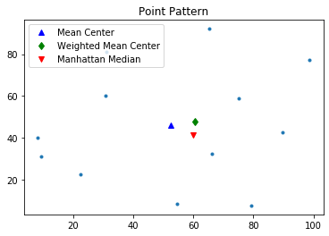

</div>
</div>
</div>


### Euclidean Median $(x_{em},y_{em})$

$$min  f(x_{em},y_{em})= \sum^n_{i=1} \sqrt{(x_i-x_{em})^2+(y_i-y_{em})^2}$$

The Euclidean Median is the location from which the sum of the Euclidean distances to all points in a distribution is a minimum. It is an optimization problem and very important for more general location allocation problems. There is no closed form solution. We can use first iterative algorithm (Kuhn and Kuenne, 1962) to approximate Euclidean Median. 


Below, we define a function named median_center with the first argument **points** a series of $(x,y)$ coordinates and the second argument **crit** the convergence criterion.


<div markdown="1" class="cell code_cell">
<div class="input_area" markdown="1">
```python
def median_center(points, crit=0.0001):
    points = np.asarray(points)
    x0, y0 = points.mean(axis=0)
    dx = np.inf
    dy = np.inf
    iteration = 0
    while np.abs(dx) > crit or np.abs(dy) > crit:
        xd = points[:, 0] - x0
        yd = points[:, 1] - y0
        d = np.sqrt(xd*xd + yd*yd)
        w = 1./d
        w = w / w.sum()
        x1 = w * points[:, 0]
        x1 = x1.sum()
        y1 = w * points[:, 1]
        y1 = y1.sum()
        dx = x1 - x0
        dy = y1 - y0
        iteration +=1 
        print(x0, x1, dx, dy, d.sum(), iteration)
        x0 = x1
        y0 = y1
               
    return x1, y1

```
</div>

</div>


<div markdown="1" class="cell code_cell">
<div class="input_area" markdown="1">
```python
median_center(pp.points, crit=.0001)

```
</div>

<div class="output_wrapper" markdown="1">
<div class="output_subarea" markdown="1">
{:.output_stream}
```
52.57166666666668 53.178128280602785 0.606461613936105 -0.9290354286335258 466.24479074356606 1
53.178128280602785 53.56643624463614 0.388307964033352 -0.4199402653980684 465.9311160558993 2
53.56643624463614 53.80720376806838 0.24076752343224683 -0.1974862190386233 465.84555867343346 3
53.80720376806838 53.95348076207835 0.1462769940099662 -0.09642613786996179 465.8197750145871 4
53.95348076207835 54.04117257066307 0.08769180858472225 -0.04872250646902643 465.8115372002813 5
54.04117257066307 54.09327726928146 0.05210469861838618 -0.025370793047137852 465.80882301324334 6
54.09327726928146 54.12405125525861 0.030773985977148755 -0.013552246205456697 465.8079149010591 7
54.12405125525861 54.14215248769505 0.018101232436443127 -0.00739190209046825 465.8076087750224 8
54.14215248769505 54.15276956049696 0.010617072801906602 -0.0040992658298719675 465.8075052025632 9
54.15276956049696 54.15898467957115 0.0062151190741914775 -0.0023026998071102867 465.80747009858044 10
54.15898467957115 54.16261796248172 0.0036332829105703013 -0.0013061853179365812 465.80745819050844 11
54.16261796248172 54.16473989468326 0.002121932201539778 -0.0007463404183738476 465.80745414933307 12
54.16473989468326 54.165978319450346 0.00123842476708802 -0.00042875101595285514 465.80745277762423 13
54.165978319450346 54.166700756153695 0.0007224367033487056 -0.00024727631074483725 465.80745231197506 14
54.166700756153695 54.16712204754273 0.0004212913890384584 -0.00014302182778891392 465.8074521538953 15
54.16712204754273 54.16736766581608 0.00024561827334679265 -8.289363293556562e-05 465.8074521002288 16
54.16736766581608 54.167510839857464 0.0001431740413835314 -4.8115880247223686e-05 465.80745208200943 17
54.167510839857464 54.167594287646125 8.344778866131719e-05 -2.7959041396741213e-05 465.807452075824 18
```
</div>
</div>
<div class="output_wrapper" markdown="1">
<div class="output_subarea" markdown="1">


{:.output_data_text}
```
(54.167594287646125, 44.42430865883205)
```


</div>
</div>
</div>


After 18 iterations, the convergence criterion is reached. The Euclidean Median is $(54.167594287646125,44.424308658832047)$.


We can also call the function **euclidean_median** in pysal to calculate the Euclidean Median.


<div markdown="1" class="cell code_cell">
<div class="input_area" markdown="1">
```python
em = euclidean_median(pp.points)
em

```
</div>

<div class="output_wrapper" markdown="1">
<div class="output_subarea" markdown="1">


{:.output_data_text}
```
array([54.16770671, 44.4242589 ])
```


</div>
</div>
</div>


The two results we get from **euclidean_median** function in pysal and the **median_center** function we define here are very much the same.


<div markdown="1" class="cell code_cell">
<div class="input_area" markdown="1">
```python
pp.plot()
plt.plot(mc[0], mc[1], 'b^', label='Mean Center')
plt.plot(wmc[0], wmc[1], 'gd', label='Weighted Mean Center')
plt.plot(mm[0], mm[1], 'rv', label='Manhattan Median')
plt.plot(em[0], em[1], 'm+', label='Euclidean Median')
plt.legend(numpoints=1)

```
</div>

<div class="output_wrapper" markdown="1">
<div class="output_subarea" markdown="1">


{:.output_data_text}
```
<matplotlib.legend.Legend at 0x7f55e50afa90>
```


</div>
</div>
<div class="output_wrapper" markdown="1">
<div class="output_subarea" markdown="1">

{:.output_png}
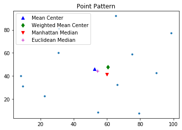

</div>
</div>
</div>


## Dispersion and Orientation

### Standard Distance & Standard Distance Circle

$$SD = \displaystyle \sqrt{\frac{\sum^n_{i=1}(x_i-x_{m})^2}{n} + \frac{\sum^n_{i=1}(y_i-y_{m})^2}{n}}$$

The Standard distance is  closely related to the usual definition of the standard deviation of a data set, and it provides a measure of how dispersed the events are around their mean center $(x_m,y_m)$.  Taken together, these measurements can be used to plot a summary circle (standard distance circle) for the point pattern, centered at $(x_m,y_m)$ with radius $SD$, as shown below.


<div markdown="1" class="cell code_cell">
<div class="input_area" markdown="1">
```python
stdd = std_distance(pp.points)
stdd

```
</div>

<div class="output_wrapper" markdown="1">
<div class="output_subarea" markdown="1">


{:.output_data_text}
```
40.14980648908671
```


</div>
</div>
</div>


Plot mean center as well as the standard distance circle.


<div markdown="1" class="cell code_cell">
<div class="input_area" markdown="1">
```python
circle1=plt.Circle((mc[0], mc[1]),stdd,color='r')
ax = pp.plot(get_ax=True, title='Standard Distance Circle')
ax.add_artist(circle1)
plt.plot(mc[0], mc[1], 'b^', label='Mean Center')
ax.set_aspect('equal')
plt.legend(numpoints=1)

```
</div>

<div class="output_wrapper" markdown="1">
<div class="output_subarea" markdown="1">


{:.output_data_text}
```
<matplotlib.legend.Legend at 0x7f55e53060f0>
```


</div>
</div>
<div class="output_wrapper" markdown="1">
<div class="output_subarea" markdown="1">

{:.output_png}
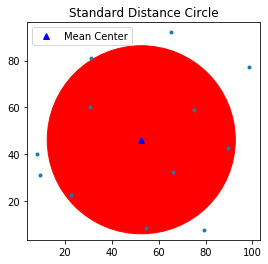

</div>
</div>
</div>


From the above figure, we can observe that there are five points outside the standard distance circle which are potential outliers.


## Standard Deviational Ellipse

Compared with standard distance circle which measures dispersion using a single parameter $SD$, standard deviational ellipse measures dispersion and trend in two dimensions through angle of rotation $\theta$, dispersion along major axis $s_x$ and dispersion along minor axis $s_y$:

* Major axis defines the direction of maximum spread in the distribution. $s_x$ is the semi-major axis (half the length of the major axis):

$$ s_x = \displaystyle \sqrt{\frac{2(\sum_{i=1}^n (x_i-\bar{x})\cos(\theta) - \sum_{i=1}^n (y_i-\bar{y})\sin(\theta))^2}{n-2}}$$

* Minor axis defines the direction of minimum spread and is orthogonal to major axis. $s_y$ is the semi-minor axis (half the length of the minor axis):

$$ s_y = \displaystyle \sqrt{\frac{2(\sum_{i=1}^n (x_i-\bar{x})\sin(\theta) - \sum_{i=1}^n (y_i-\bar{y})\cos(\theta))^2}{n-2}}$$

* The ellipse is rotated clockwise through an angle $\theta$:

$$\theta = \displaystyle \arctan{\{ (\sum_i(x_i-\bar{x})^2-\sum_i(y_i-\bar{y})^2) + \frac{[(\sum_i(x_i-\bar{x})^2-\sum_i(y_i-\bar{y})^2)^2 + 4(\sum_i(x-\bar{x})(y_i-\bar{y}))^2]^\frac{1}{2}}{2\sum_i(x-\bar{x})(y_i-\bar{y})}\}}$$


<div markdown="1" class="cell code_cell">
<div class="input_area" markdown="1">
```python
sx, sy, theta = ellipse(pp.points)
sx, sy, theta

```
</div>

<div class="output_wrapper" markdown="1">
<div class="output_subarea" markdown="1">


{:.output_data_text}
```
(39.62386788646298, 42.753818949026815, 1.1039268428650906)
```


</div>
</div>
</div>


<div markdown="1" class="cell code_cell">
<div class="input_area" markdown="1">
```python
theta_degree = np.degrees(theta) #need degree of rotation to plot the ellipse
theta_degree

```
</div>

<div class="output_wrapper" markdown="1">
<div class="output_subarea" markdown="1">


{:.output_data_text}
```
63.250348987371304
```


</div>
</div>
</div>


The Standard Deviational Ellipse for the point pattern is rotated clockwise by $63.25^{\circ}$.


<div markdown="1" class="cell code_cell">
<div class="input_area" markdown="1">
```python
from matplotlib.patches import Ellipse
from pylab import figure, show,rand
fig = figure()
#ax = fig.add_subplot(111, aspect='equal')
e = Ellipse(xy=mean_center(pp.points), width=sx*2, height=sy*2, angle=-theta_degree) #angle is rotation in degrees (anti-clockwise)
ax = pp.plot(get_ax=True, title='Standard Deviational Ellipse')
ax.add_artist(e)
e.set_clip_box(ax.bbox)
e.set_facecolor([0.8,0,0])
e.set_edgecolor([1,0,0])
ax.set_xlim(0,100)
ax.set_ylim(0,100)
ax.set_aspect('equal')
plt.plot(mc[0], mc[1], 'b^', label='Mean Center')
plt.legend(numpoints=1)
show()

```
</div>

<div class="output_wrapper" markdown="1">
<div class="output_subarea" markdown="1">
{:.output_data_text}
```
<Figure size 432x288 with 0 Axes>
```

</div>
</div>
<div class="output_wrapper" markdown="1">
<div class="output_subarea" markdown="1">

{:.output_png}
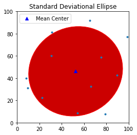

</div>
</div>
</div>


## Shape Analysis


### [Convex Hull](https://en.wikipedia.org/wiki/Convex_hull)

The convex hull of a point pattern *pp* is the smallest convex set that contains *pp*. We can call function **hull** to caculate the convex hull.


<div markdown="1" class="cell code_cell">
<div class="input_area" markdown="1">
```python
hull(pp.points)

```
</div>

<div class="output_wrapper" markdown="1">
<div class="output_subarea" markdown="1">


{:.output_data_text}
```
array([[31.01, 81.21],
       [ 8.23, 39.93],
       [ 9.47, 31.02],
       [22.52, 22.39],
       [54.46,  8.48],
       [79.26,  7.68],
       [89.78, 42.53],
       [98.73, 77.17],
       [65.19, 92.08]])
```


</div>
</div>
</div>


By specifying "hull" argument **True** in PointPattern class method **plot**, we can easily plot convex hull of the point pattern.


<div markdown="1" class="cell code_cell">
<div class="input_area" markdown="1">
```python
pp.plot(title='Centers', hull=True ) #plot point pattern "pp" as well as its convex hull
plt.plot(mc[0], mc[1], 'b^', label='Mean Center')
plt.plot(wmc[0], wmc[1], 'gd', label='Weighted Mean Center')
plt.plot(mm[0], mm[1], 'rv', label='Manhattan Median')
plt.plot(em[0], em[1], 'm+', label='Euclidean Median')
plt.legend(numpoints=1)

```
</div>

<div class="output_wrapper" markdown="1">
<div class="output_subarea" markdown="1">


{:.output_data_text}
```
<matplotlib.legend.Legend at 0x7f55e4f9aeb8>
```


</div>
</div>
<div class="output_wrapper" markdown="1">
<div class="output_subarea" markdown="1">

{:.output_png}
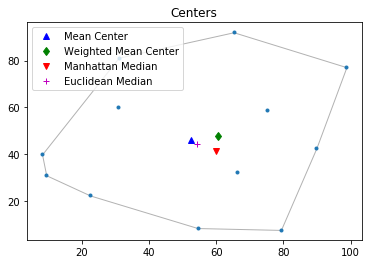

</div>
</div>
</div>


### [Minimum Bounding Rectangle](https://en.wikipedia.org/wiki/Minimum_bounding_rectangle)

Minimum Bounding Rectangle (Box) is the same as the minimum bounding Rectangle of its convex hull. Thus, it is almost always bigger than convex hull.

We can call **mbr** function to calculate the leftmost, downmost, rightmost, and upmost value of the vertices of minimum bounding rectangle.


<div markdown="1" class="cell code_cell">
<div class="input_area" markdown="1">
```python
mbr(pp.points)

```
</div>

<div class="output_wrapper" markdown="1">
<div class="output_subarea" markdown="1">


{:.output_data_text}
```
(8.23, 7.68, 98.73, 92.08)
```


</div>
</div>
</div>


Thus, four vertices of the  minimum bounding rectangle is $(8.23,7.68),(98.73,7.68),(98.73,92.08),(8.23,92.08)$.


<div markdown="1" class="cell code_cell">
<div class="input_area" markdown="1">
```python
pp.plot(title='Centers', window=True ) #plot point pattern "pp" as well as its Minimum Bounding Rectangle
plt.plot(mc[0], mc[1], 'b^', label='Mean Center')
plt.plot(wmc[0], wmc[1], 'gd', label='Weighted Mean Center')
plt.plot(mm[0], mm[1], 'rv', label='Manhattan Median')
plt.plot(em[0], em[1], 'm+', label='Euclidean Median')
plt.legend(numpoints=1)

```
</div>

<div class="output_wrapper" markdown="1">
<div class="output_subarea" markdown="1">


{:.output_data_text}
```
<matplotlib.legend.Legend at 0x7f55e4f95e80>
```


</div>
</div>
<div class="output_wrapper" markdown="1">
<div class="output_subarea" markdown="1">

{:.output_png}


</div>
</div>
</div>


<div markdown="1" class="cell code_cell">
<div class="input_area" markdown="1">
```python
pp.plot(title='Centers',  hull=True , window=True )#plot point pattern "pp", convex hull, and Minimum Bounding Rectangle
plt.plot(mc[0], mc[1], 'b^', label='Mean Center')
plt.plot(wmc[0], wmc[1], 'gd', label='Weighted Mean Center')
plt.plot(mm[0], mm[1], 'rv', label='Manhattan Median')
plt.plot(em[0], em[1], 'm+', label='Euclidean Median')
plt.legend(numpoints=1)

```
</div>

<div class="output_wrapper" markdown="1">
<div class="output_subarea" markdown="1">


{:.output_data_text}
```
<matplotlib.legend.Legend at 0x7f55e4f10e48>
```


</div>
</div>
<div class="output_wrapper" markdown="1">
<div class="output_subarea" markdown="1">

{:.output_png}


</div>
</div>
</div>


Plot Standard Distance Circle and Convex Hull.


<div markdown="1" class="cell code_cell">
<div class="input_area" markdown="1">
```python
circle1=plt.Circle((mc[0], mc[1]),stdd,color='r',alpha=0.2)
ax = pp.plot(get_ax=True, title='Standard Distance Circle', hull=True)
ax.add_artist(circle1)
plt.plot(mc[0], mc[1], 'b^', label='Mean Center')
ax.set_aspect('equal')
plt.legend(numpoints=1)

```
</div>

<div class="output_wrapper" markdown="1">
<div class="output_subarea" markdown="1">


{:.output_data_text}
```
<matplotlib.legend.Legend at 0x7f55e4e8bba8>
```


</div>
</div>
<div class="output_wrapper" markdown="1">
<div class="output_subarea" markdown="1">

{:.output_png}
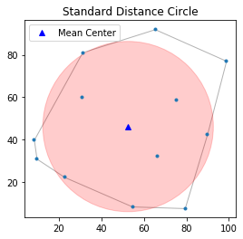

</div>
</div>
</div>


## Another Example

We apply the  centrography statistics and visualization to 2 simulated random datasets.


<div markdown="1" class="cell code_cell">
<div class="input_area" markdown="1">
```python
#from pysal.contrib import shapely_ext
from pysal.lib.cg import shapely_ext
from pysal.explore.pointpats import PoissonPointProcess as csr
import pysal.lib as ps
from pysal.explore.pointpats import as_window
#import pysal_examples

# open "vautm17n" polygon shapefile
va = ps.io.open(ps.examples.get_path("vautm17n.shp"))

# Create the exterior polygons for VA from the union of the county shapes
polys = [shp for shp in va]
state = shapely_ext.cascaded_union(polys)

```
</div>

</div>


#### Simulate a 100-point dataset within VA state border from a CSR (complete spatial randomness) process.


<div markdown="1" class="cell code_cell">
<div class="input_area" markdown="1">
```python
pp = csr(as_window(state), 100, 1, asPP=True).realizations[0]
pp.plot(window=True)

```
</div>

<div class="output_wrapper" markdown="1">
<div class="output_subarea" markdown="1">

{:.output_png}
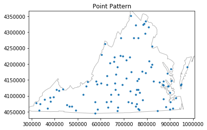

</div>
</div>
</div>


<div markdown="1" class="cell code_cell">
<div class="input_area" markdown="1">
```python
pp.plot(window=True, hull=True)

```
</div>

<div class="output_wrapper" markdown="1">
<div class="output_subarea" markdown="1">

{:.output_png}


</div>
</div>
</div>


<div markdown="1" class="cell code_cell">
<div class="input_area" markdown="1">
```python
mc = mean_center(pp.points)
mm = manhattan_median(pp.points)
em = euclidean_median(pp.points)
pp.plot(title='Centers',  hull=True , window=True )#plot point pattern "pp", convex hull, and Minimum Bounding Rectangle
plt.plot(mc[0], mc[1], 'c^', label='Mean Center')
plt.plot(mm[0], mm[1], 'rv', label='Manhattan Median')
plt.plot(em[0], em[1], 'm+', label='Euclidean Median')
plt.legend(numpoints=1)

```
</div>

<div class="output_wrapper" markdown="1">
<div class="output_subarea" markdown="1">


{:.output_data_text}
```
<matplotlib.legend.Legend at 0x7f55e4c22ac8>
```


</div>
</div>
<div class="output_wrapper" markdown="1">
<div class="output_subarea" markdown="1">

{:.output_png}
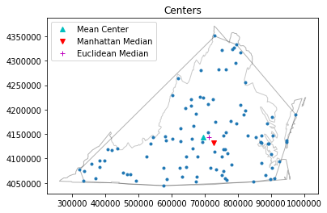

</div>
</div>
</div>


Plot Standard Distance Circle of the simulated point pattern.


<div markdown="1" class="cell code_cell">
<div class="input_area" markdown="1">
```python
sx, sy, theta = ellipse(pp.points)
sx, sy, theta
theta_degree = np.degrees(theta) #need degree of rotation to plot the ellipse
from matplotlib.patches import Ellipse
from pylab import figure, show,rand
fig = figure()
#ax = fig.add_subplot(111, aspect='equal')
e = Ellipse(xy=mean_center(pp.points), width=sx*2, height=sy*2, angle=-theta_degree)
ax = pp.plot(get_ax=True, title='Standard Deviational Ellipse')
ax.add_artist(e)
e.set_clip_box(ax.bbox)
e.set_facecolor([0.8,0,0])
e.set_edgecolor([1,0,0])
ax.set_xlim(300000,1000000)
ax.set_ylim(4050000,4350000)
#ax.set_aspect('equal')
plt.plot(mc[0], mc[1], 'c^', label='Mean Center')
plt.legend(numpoints=1)
show()

```
</div>

<div class="output_wrapper" markdown="1">
<div class="output_subarea" markdown="1">
{:.output_data_text}
```
<Figure size 432x288 with 0 Axes>
```

</div>
</div>
<div class="output_wrapper" markdown="1">
<div class="output_subarea" markdown="1">

{:.output_png}
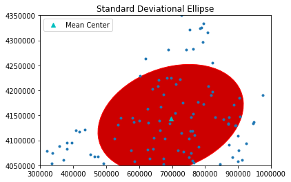

</div>
</div>
</div>


#### Simulate a 500-point dataset within VA state border from a CSR (complete spatial randomness) process.


<div markdown="1" class="cell code_cell">
<div class="input_area" markdown="1">
```python
pp = csr(as_window(state), 500, 1, asPP=True).realizations[0]
pp.plot(window=True)

```
</div>

<div class="output_wrapper" markdown="1">
<div class="output_subarea" markdown="1">

{:.output_png}
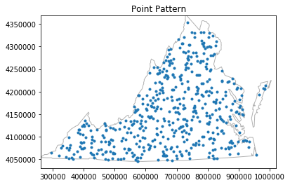

</div>
</div>
</div>


<div markdown="1" class="cell code_cell">
<div class="input_area" markdown="1">
```python
pp.plot(window=True, hull=True)

```
</div>

<div class="output_wrapper" markdown="1">
<div class="output_subarea" markdown="1">

{:.output_png}
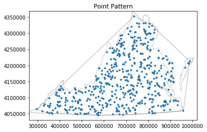

</div>
</div>
</div>


<div markdown="1" class="cell code_cell">
<div class="input_area" markdown="1">
```python
mc = mean_center(pp.points)
mm = manhattan_median(pp.points)
em = euclidean_median(pp.points)
pp.plot(title='Centers',  hull=True , window=True )#plot point pattern "pp", convex hull, and Minimum Bounding Rectangle
plt.plot(mc[0], mc[1], 'c^', label='Mean Center')
plt.plot(mm[0], mm[1], 'rv', label='Manhattan Median')
plt.plot(em[0], em[1], 'm+', label='Euclidean Median')
plt.legend(numpoints=1)

```
</div>

<div class="output_wrapper" markdown="1">
<div class="output_subarea" markdown="1">


{:.output_data_text}
```
<matplotlib.legend.Legend at 0x7f55e4e62588>
```


</div>
</div>
<div class="output_wrapper" markdown="1">
<div class="output_subarea" markdown="1">

{:.output_png}
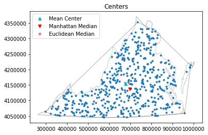

</div>
</div>
</div>


<div markdown="1" class="cell code_cell">
<div class="input_area" markdown="1">
```python
sx, sy, theta = ellipse(pp.points)
sx, sy, theta
theta_degree = np.degrees(theta) #need degree of rotation to plot the ellipse
from matplotlib.patches import Ellipse
from pylab import figure, show,rand
fig = figure()
#ax = fig.add_subplot(111, aspect='equal')
e = Ellipse(xy=mean_center(pp.points), width=sx*2, height=sy*2, angle=-theta_degree)
ax = pp.plot(get_ax=True, title='Standard Deviational Ellipse')
ax.add_artist(e)
e.set_clip_box(ax.bbox)
e.set_facecolor([0.8,0,0])
e.set_edgecolor([1,0,0])
ax.set_xlim(300000,1000000)
ax.set_ylim(4050000,4350000)
#ax.set_aspect('equal')
plt.plot(mc[0], mc[1], 'c^', label='Mean Center')
plt.legend(numpoints=1)
show()

```
</div>

<div class="output_wrapper" markdown="1">
<div class="output_subarea" markdown="1">
{:.output_data_text}
```
<Figure size 432x288 with 0 Axes>
```

</div>
</div>
<div class="output_wrapper" markdown="1">
<div class="output_subarea" markdown="1">

{:.output_png}
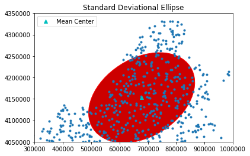

</div>
</div>
</div>


If we calculate the Euclidean distances between every event point and Mean Center (Euclidean Median), and sum them up, we can see that Euclidean Median is the optimal point in iterms of minimizing the Euclidean distances to all the event points.


<div markdown="1" class="cell code_cell">
<div class="input_area" markdown="1">
```python
from pysal.explore.pointpats import dtot
print(dtot(mc, pp.points))
print(dtot(em, pp.points))
print(dtot(mc, pp.points) > dtot(em, pp.points))

```
</div>

<div class="output_wrapper" markdown="1">
<div class="output_subarea" markdown="1">
{:.output_stream}
```
73007071.24620631
72780262.40401942
True
```
</div>
</div>
</div>

