---
redirect_from:
  - "/explore/pointpats/distance-statistics"
interact_link: content/explore/pointpats/distance_statistics.ipynb
title: 'distance_statistics'
prev_page:
  url: /explore/pointpats/centrography
  title: 'centrography'
next_page:
  url: /explore/pointpats/marks
  title: 'marks'
comment: "***PROGRAMMATICALLY GENERATED, DO NOT EDIT. SEE ORIGINAL FILES IN /content***"
---

# Distance Based Statistical Method for Planar Point Patterns

**Authors: Serge Rey <sjsrey@gmail.com> and Wei Kang <weikang9009@gmail.com>**

## Introduction

Distance based methods for point patterns are of three types:

* [Mean Nearest Neighbor Distance Statistics](#Mean-Nearest-Neighbor-Distance-Statistics)
* [Nearest Neighbor Distance Functions](#Nearest-Neighbor-Distance-Functions)
* [Interevent Distance Functions](#Interevent-Distance-Functions)

In addition, we are going to introduce a computational technique [Simulation Envelopes](#Simulation-Envelopes) to aid in making inferences about the data generating process. An [example](#CSR-Example) is used to demonstrate how to use and interprete simulation envelopes.


{:.input_area}
```python
import scipy.spatial
import libpysal as ps
import numpy as np
from pointpats import PointPattern, PoissonPointProcess, as_window, G, F, J, K, L, Genv, Fenv, Jenv, Kenv, Lenv
%matplotlib inline
import matplotlib.pyplot as plt
```


## Mean Nearest Neighbor Distance Statistics

The nearest neighbor(s) for a point $u$ is the point(s) $N(u)$ which meet the condition
$$d_{u,N(u)} \leq d_{u,j} \forall j \in S - u$$

The distance between the nearest neighbor(s) $N(u)$ and the point $u$ is nearest neighbor distance for $u$. After searching for nearest neighbor(s) for all the points and calculating the corresponding distances, we are able to calculate mean nearest neighbor distance by averaging these distances.

It was demonstrated by Clark and Evans(1954) that mean nearest neighbor distance statistics distribution is a normal distribution under null hypothesis (underlying spatial process is CSR). We can utilize the test statistics to determine whether the point pattern is the outcome of CSR. If not, is it the outcome of cluster or regular
spatial process?

Mean nearest neighbor distance statistic

$$\bar{d}_{min}=\frac{1}{n} \sum_{i=1}^n d_{min}(s_i)$$


{:.input_area}
```python
points = [[66.22, 32.54], [22.52, 22.39], [31.01, 81.21],
          [9.47, 31.02],  [30.78, 60.10], [75.21, 58.93],
          [79.26,  7.68], [8.23, 39.93],  [98.73, 77.17],
          [89.78, 42.53], [65.19, 92.08], [54.46, 8.48]]
pp = PointPattern(points)
```


{:.input_area}
```python
pp.summary()
```


{:.output_stream}
```
Point Pattern
12 points
Bounding rectangle [(8.23,7.68), (98.73,92.08)]
Area of window: 7638.200000000002
Intensity estimate for window: 0.0015710507711240865
       x      y
0  66.22  32.54
1  22.52  22.39
2  31.01  81.21
3   9.47  31.02
4  30.78  60.10

```

We may call the method **knn** in PointPattern class to find $k$ nearest neighbors for each point in the point pattern *pp*.


{:.input_area}
```python
# one nearest neighbor (default)
pp.knn()
```


{:.output_data_text}
```
(array([[ 9],
        [ 3],
        [ 4],
        [ 7],
        [ 2],
        [ 9],
        [11],
        [ 3],
        [ 5],
        [ 5],
        [ 5],
        [ 6]]), array([[25.59050019],
        [15.64542745],
        [21.11125292],
        [ 8.99587128],
        [21.11125292],
        [21.93729473],
        [24.81289987],
        [ 8.99587128],
        [29.76387072],
        [21.93729473],
        [34.63124168],
        [24.81289987]]))
```


The first array is the ids of the most nearest neighbor for each point, the second array is the distance between each point and its  most nearest neighbor.


{:.input_area}
```python
# two nearest neighbors
pp.knn(2)
```


{:.output_data_text}
```
(array([[ 9, 11],
        [ 3,  7],
        [ 4, 10],
        [ 7,  1],
        [ 2,  7],
        [ 9,  0],
        [11,  0],
        [ 3,  1],
        [ 5,  9],
        [ 5,  0],
        [ 5,  2],
        [ 6,  0]]), array([[25.59050019, 26.78023898],
        [15.64542745, 22.62422816],
        [21.11125292, 35.86682729],
        [ 8.99587128, 15.64542745],
        [21.11125292, 30.2544443 ],
        [21.93729473, 27.87924317],
        [24.81289987, 28.07242775],
        [ 8.99587128, 22.62422816],
        [29.76387072, 35.77753625],
        [21.93729473, 25.59050019],
        [34.63124168, 35.86682729],
        [24.81289987, 26.78023898]]))
```


{:.input_area}
```python
pp.max_nnd # Maximum nearest neighbor distance
```


{:.output_data_text}
```
34.63124167568931
```


{:.input_area}
```python
pp.min_nnd # Minimum nearest neighbor distance
```


{:.output_data_text}
```
8.995871275201752
```


{:.input_area}
```python
pp.mean_nnd # mean nearest neighbor distance
```


{:.output_data_text}
```
21.612139802089246
```


{:.input_area}
```python
pp.nnd # Nearest neighbor distances
```


{:.output_data_text}
```
array([[25.59050019],
       [15.64542745],
       [21.11125292],
       [ 8.99587128],
       [21.11125292],
       [21.93729473],
       [24.81289987],
       [ 8.99587128],
       [29.76387072],
       [21.93729473],
       [34.63124168],
       [24.81289987]])
```


{:.input_area}
```python
pp.nnd.sum()/pp.n # same as pp.mean_nnd
```


{:.output_data_text}
```
21.612139802089246
```


{:.input_area}
```python
pp.plot()
```


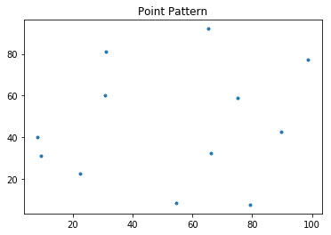


## Nearest Neighbor Distance Functions

Nearest neighbour distance distribution functions (including the nearest “event-to-event” and “point-event” distance distribution functions) of a point process are cumulative distribution functions of several kinds -- $G, F, J$. By comparing the distance function of the observed point pattern with that of the point pattern from a CSR process, we are able to infer whether the underlying spatial process of the observed point pattern is CSR or not for a given confidence level.

#### $G$ function - event-to-event

The $G$ function is defined as follows: for a given distance $d$, $G(d)$ is the proportion of nearest neighbor distances that are less than $d$.
$$G(d) = \sum_{i=1}^n \frac{ \phi_i^d}{n}$$

$$ 
\phi_i^d =
 \begin{cases}
    1       & \quad \text{if } d_{min}(s_i)<d \\
    0       & \quad \text{otherwise } \\
  \end{cases}
$$

If the underlying point process is a CSR process, $G$ function has an expectation of:
$$
G(d) = 1-e(-\lambda \pi d^2)
$$
However, if the $G$ function plot is above the expectation this reflects clustering, while departures below expectation reflect dispersion.


{:.input_area}
```python
gp1 = G(pp, intervals=20)
gp1.plot()

```


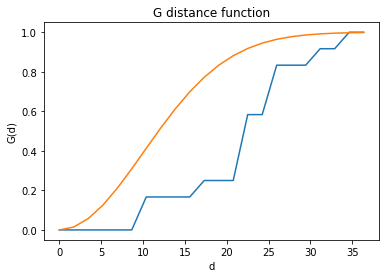


A slightly different visualization of the empirical function is the quantile-quantile plot:


{:.input_area}
```python
gp1.plot(qq=True)
```


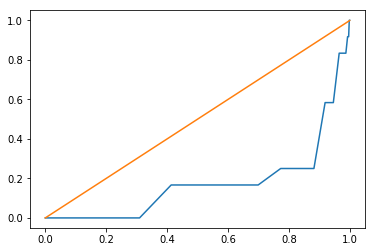


in the q-q plot the csr function is now a diagonal line which serves to make accessment of departures from csr visually easier.

It is obvious that the above $G$ increases very slowly at small distances and the line is below the expected value for a CSR process (green  line). We might think that the underlying spatial process is regular point process. However, this visual inspection is not enough for a final conclusion.  In [Simulation Envelopes](#Simulation-Envelopes), we are going to demonstrate how to simulate data under CSR many times and construct the $95\%$ simulation envelope for $G$.


{:.input_area}
```python
gp1.d # distance domain sequence (corresponding to the x-axis)
```


{:.output_data_text}
```
array([ 0.        ,  1.73156208,  3.46312417,  5.19468625,  6.92624834,
        8.65781042, 10.3893725 , 12.12093459, 13.85249667, 15.58405875,
       17.31562084, 19.04718292, 20.77874501, 22.51030709, 24.24186917,
       25.97343126, 27.70499334, 29.43655542, 31.16811751, 32.89967959,
       34.63124168, 36.36280376])
```


{:.input_area}
```python
gp1.G #cumulative nearest neighbor distance distribution over d (corresponding to the y-axis))
```


{:.output_data_text}
```
array([0.        , 0.        , 0.        , 0.        , 0.        ,
       0.        , 0.16666667, 0.16666667, 0.16666667, 0.16666667,
       0.25      , 0.25      , 0.25      , 0.58333333, 0.58333333,
       0.83333333, 0.83333333, 0.83333333, 0.91666667, 0.91666667,
       1.        , 1.        ])
```


#### $F$ function - "point-event"

When the number of events in a point pattern is small, $G$ function is rough (see the $G$ function plot for the 12 size point pattern above). One way to get around this is to turn to $F$ funtion where a given number of randomly distributed points are generated in the domain and the nearest event neighbor distance is calculated for each point. The cumulative distribution of all nearest event neighbor distances is called $F$ function.


{:.input_area}
```python
fp1 = F(pp, intervals=20) # The default is to randomly generate 100 points.
fp1.plot()
```


{:.input_area}
```python
fp1.plot(qq=True)
```


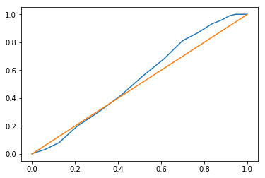


We can increase the number of intervals to make $F$ more smooth.


{:.input_area}
```python
fp1 = F(pp, intervals=50)
fp1.plot()
```


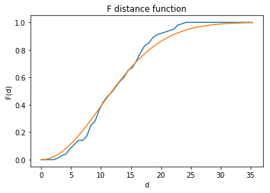


{:.input_area}
```python
fp1.plot(qq=True)
```


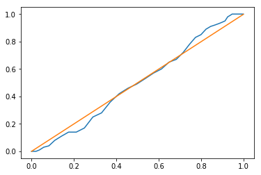


$F$ function is more smooth than $G$ function. 

#### $J$ function - a combination of "event-event" and "point-event"

$J$ function is defined as follows:

$$J(d) = \frac{1-G(d)}{1-F(d)}$$

If $J(d)<1$, the underlying point process is a cluster point process; if $J(d)=1$, the underlying point process is a random point process; otherwise, it is a regular point process.


{:.input_area}
```python
jp1 = J(pp, intervals=20)
jp1.plot()
```


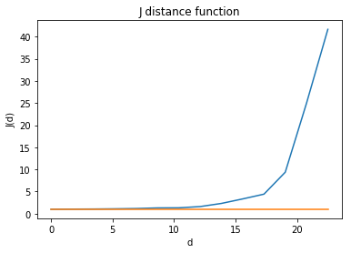


From the above figure, we can observe that $J$ function is obviously above the $J(d)=1$ horizontal line. It is approaching infinity with nearest neighbor distance increasing. We might tend to conclude that the underlying point process is a regular one.

## Interevent Distance Functions

Nearest neighbor distance functions consider only the nearest neighbor distances, "event-event", "point-event" or the combination. Thus, distances to higer order neighbors are ignored, which might reveal important information regarding the point process. Interevent distance functions, including $K$ and $L$ functions, are proposed to consider distances between all pairs of event points. Similar to $G$, $F$ and $J$ functions, $K$ and $L$ functions are also cumulative distribution function.

#### $K$ function - "interevent"

Given distance $d$, $K(d)$ is defined as:
$$K(d) = \frac{\sum_{i=1}^n \sum_{j=1}^n \psi_{ij}(d)}{n \hat{\lambda}}$$

where
$$ 
\psi_{ij}(d) =
 \begin{cases}
    1       & \quad \text{if } d_{ij}<d \\
    0       & \quad \text{otherwise } \\
  \end{cases}
$$

$\sum_{j=1}^n \psi_{ij}(d)$ is the number of events within a circle of radius $d$ centered on event $s_i$ .

Still, we use CSR as the benchmark (null hypothesis) and see how the $K$ funtion estimated from the observed point pattern deviate from that under CSR, which is $K(d)=\pi d^2$. $K(d)<\pi d^2$ indicates that the underlying point process is a regular point process. $K(d)>\pi d^2$ indicates that the underlying point process is a cluster point process. 


{:.input_area}
```python
kp1 = K(pp)
kp1.plot()
```


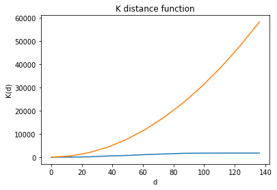


#### $L$ function - "interevent"

$L$ function is a scaled version of $K$ function, defined as:
$$L(d) = \sqrt{\frac{K(d)}{\pi}}-d$$


{:.input_area}
```python
lp1 = L(pp)
lp1.plot()
```


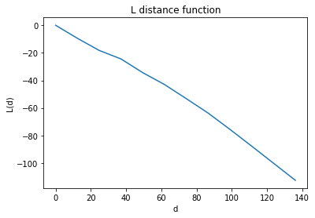


## Simulation Envelopes

A [Simulation envelope](http://www.esajournals.org/doi/pdf/10.1890/13-2042.1) is a computer intensive technique for inferring whether an observed pattern significantly deviates from what would be expected under a specific process. Here, we always use CSR as the benchmark. In order to construct a simulation envelope for a given function, we need to simulate CSR a lot of times, say $1000$ times. Then, we can calculate the function for each simulated point pattern. For every distance $d$, we sort the function values of the $1000$ simulated point patterns. Given a confidence level, say $95\%$, we can acquire the $25$th and $975$th value for every distance $d$. Thus, a simulation envelope is constructed. 

#### Simulation Envelope for G function

**Genv** class in pysal.


{:.input_area}
```python
realizations = PoissonPointProcess(pp.window, pp.n, 100, asPP=True) # simulate CSR 100 times
genv = Genv(pp, intervals=20, realizations=realizations) # call Genv to generate simulation envelope
genv
```


{:.output_data_text}
```
<pointpats.distance_statistics.Genv at 0x1b22d502b0>
```


{:.input_area}
```python
genv.observed 
```


{:.output_data_text}
```
array([[ 0.        ,  0.        ],
       [ 1.73156208,  0.        ],
       [ 3.46312417,  0.        ],
       [ 5.19468625,  0.        ],
       [ 6.92624834,  0.        ],
       [ 8.65781042,  0.        ],
       [10.3893725 ,  0.16666667],
       [12.12093459,  0.16666667],
       [13.85249667,  0.16666667],
       [15.58405875,  0.16666667],
       [17.31562084,  0.25      ],
       [19.04718292,  0.25      ],
       [20.77874501,  0.25      ],
       [22.51030709,  0.58333333],
       [24.24186917,  0.58333333],
       [25.97343126,  0.83333333],
       [27.70499334,  0.83333333],
       [29.43655542,  0.83333333],
       [31.16811751,  0.91666667],
       [32.89967959,  0.91666667],
       [34.63124168,  1.        ],
       [36.36280376,  1.        ]])
```


{:.input_area}
```python
genv.plot()
```


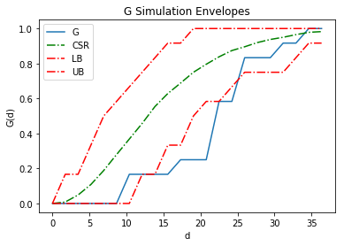


In the above figure, **LB** and **UB** comprise the simulation envelope. **CSR** is the mean function calculated from the simulated data. **G** is the function estimated from the observed point pattern. It is well below the simulation envelope. We can infer that the underlying point process is a regular one.

#### Simulation Envelope for F function

**Fenv** class in pysal.


{:.input_area}
```python
fenv = Fenv(pp, intervals=20, realizations=realizations)
fenv.plot()
```


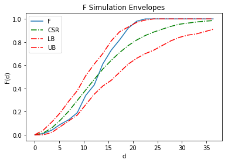


#### Simulation Envelope for J function

**Jenv** class in pysal.


{:.input_area}
```python
jenv = Jenv(pp, intervals=20, realizations=realizations)
jenv.plot()
```


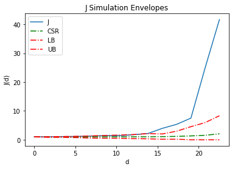


#### Simulation Envelope for K function

**Kenv** class in pysal.


{:.input_area}
```python
kenv = Kenv(pp, intervals=20, realizations=realizations)
kenv.plot()
```


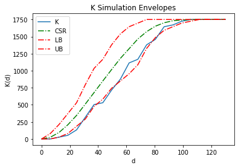


#### Simulation Envelope for L function

**Lenv** class in pysal.


{:.input_area}
```python
lenv = Lenv(pp, intervals=20, realizations=realizations)
lenv.plot()
```


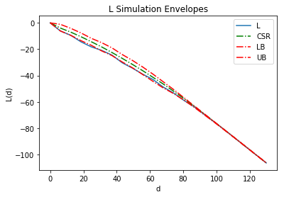


## CSR Example
In this example, we are going to generate a point pattern as the "observed" point pattern. The data generating process is CSR. Then, we will simulate CSR in the same domain for 100 times and construct a simulation envelope for each function.


{:.input_area}
```python
from libpysal.cg import shapely_ext
from pointpats import Window
import libpysal as ps
va = ps.io.open(ps.examples.get_path("vautm17n.shp"))
polys = [shp for shp in va]
state = shapely_ext.cascaded_union(polys)
```


Generate the point pattern **pp** (size 100) from CSR as the "observed" point pattern.


{:.input_area}
```python
a = [[1],[1,2]]
np.asarray(a)
```


{:.output_data_text}
```
array([list([1]), list([1, 2])], dtype=object)
```


{:.input_area}
```python
n = 100
samples = 1
pp = PoissonPointProcess(Window(state.parts), n, samples, asPP=True)
pp.realizations[0]
```


{:.output_data_text}
```
<pointpats.pointpattern.PointPattern at 0x1b22d31cf8>
```


{:.input_area}
```python
pp.n
```


{:.output_data_text}
```
100
```


Simulate CSR in the same domian for 100 times which would be used for constructing simulation envelope under the null hypothesis of CSR.


{:.input_area}
```python
csrs = PoissonPointProcess(pp.window, 100, 100, asPP=True)
csrs
```


{:.output_data_text}
```
<pointpats.process.PoissonPointProcess at 0x1b22d31240>
```


Construct the simulation envelope for $G$ function.


{:.input_area}
```python
genv = Genv(pp.realizations[0], realizations=csrs)
genv.plot()
```


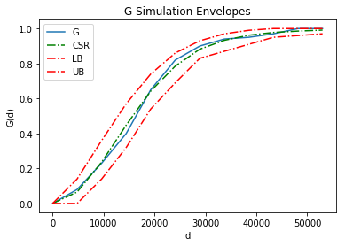


Since the "observed" $G$ is well contained by the simulation envelope, we infer that the underlying point process is a random process.


{:.input_area}
```python
genv.low # lower bound of the simulation envelope for G
```


{:.output_data_text}
```
array([0.  , 0.  , 0.14, 0.32, 0.54, 0.69, 0.83, 0.87, 0.91, 0.95, 0.96,
       0.97])
```


{:.input_area}
```python
genv.high # higher bound of the simulation envelope for G
```


{:.output_data_text}
```
array([0.  , 0.14, 0.36, 0.57, 0.74, 0.86, 0.93, 0.97, 0.99, 1.  , 1.  ,
       1.  ])
```


Construct the simulation envelope for $F$ function.


{:.input_area}
```python
fenv = Fenv(pp.realizations[0], realizations=csrs)
fenv.plot()
```


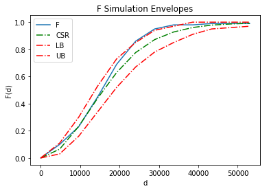


Construct the simulation envelope for $J$ function.


{:.input_area}
```python
jenv = Jenv(pp.realizations[0], realizations=csrs)
jenv.plot()
```


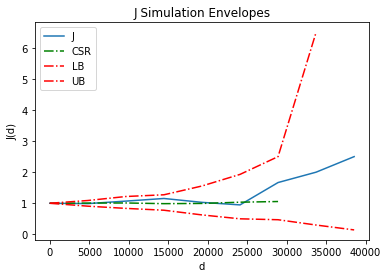


Construct the simulation envelope for $K$ function.


{:.input_area}
```python
kenv = Kenv(pp.realizations[0], realizations=csrs)
kenv.plot()
```


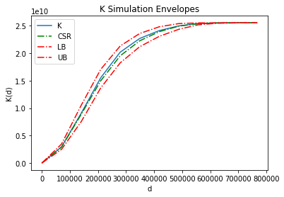


Construct the simulation envelope for $L$ function.


{:.input_area}
```python
lenv = Lenv(pp.realizations[0], realizations=csrs)
lenv.plot()
```


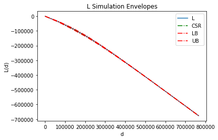

