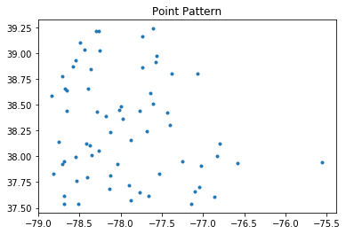
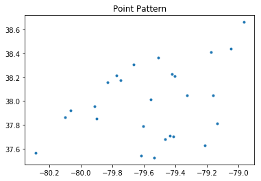
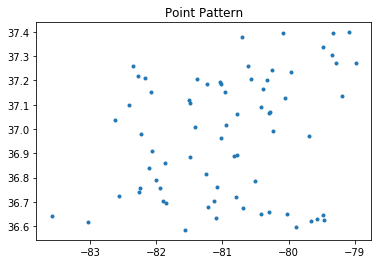
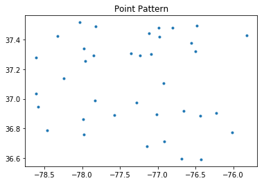
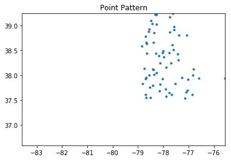
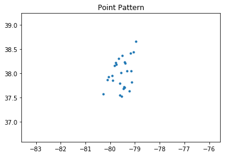
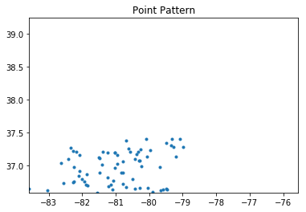
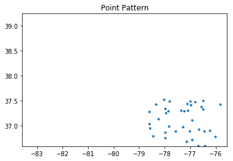

# Marked Point Pattern

In addition to the [unmarked point pattern](pointpattern.ipynb), non-binary attributes might be associated with each point, leading to the so-called marked point pattern. The charactertistics of a marked point pattern are:

* Location pattern of the events are of interest
* Stochastic attribute attached to the events is of interest

Unmarked point pattern can be modified to be a marked point pattern using the method **add_marks** while the method **explode** could decompose a marked point pattern into a sequence of unmarked point patterns. Both methods belong to the class **PointPattern**.


<div markdown="1" class="cell code_cell">
<div class="input_area" markdown="1">
```python
from pysal.explore.pointpats import PoissonPointProcess, PoissonClusterPointProcess, Window, poly_from_bbox, PointPattern
import pysal.lib as ps
from pysal.lib.cg import shapely_ext
%matplotlib inline
import matplotlib.pyplot as plt

```
</div>

</div>


<div markdown="1" class="cell code_cell">
<div class="input_area" markdown="1">
```python
# open the virginia polygon shapefile
va = ps.io.open(ps.examples.get_path("virginia.shp"))
polys = [shp for shp in va]

```
</div>

</div>


<div markdown="1" class="cell code_cell">
<div class="input_area" markdown="1">
```python
# Create the exterior polygons for VA from the union of the county shapes
state = shapely_ext.cascaded_union(polys)
# create window from virginia state boundary
window = Window(state.parts)

```
</div>

</div>


<div markdown="1" class="cell code_cell">
<div class="input_area" markdown="1">
```python
window.bbox

```
</div>

<div class="output_wrapper" markdown="1">
<div class="output_subarea" markdown="1">


{:.output_data_text}
```
[-83.67526245117188, 36.541481018066406, -75.24258422851562, 39.45690155029297]
```


</div>
</div>
</div>


<div markdown="1" class="cell code_cell">
<div class="input_area" markdown="1">
```python
window.centroid

```
</div>

<div class="output_wrapper" markdown="1">
<div class="output_subarea" markdown="1">


{:.output_data_text}
```
(-78.85183583334933, 37.51851209850039)
```


</div>
</div>
</div>


<div markdown="1" class="cell code_cell">
<div class="input_area" markdown="1">
```python
samples = PoissonPointProcess(window, 200, 1, conditioning=False, asPP=False)

```
</div>

</div>


<div markdown="1" class="cell code_cell">
<div class="input_area" markdown="1">
```python
csr = PointPattern(samples.realizations[0])

```
</div>

</div>


<div markdown="1" class="cell code_cell">
<div class="input_area" markdown="1">
```python
cx, cy = window.centroid

```
</div>

</div>


<div markdown="1" class="cell code_cell">
<div class="input_area" markdown="1">
```python
cx

```
</div>

<div class="output_wrapper" markdown="1">
<div class="output_subarea" markdown="1">


{:.output_data_text}
```
-78.85183583334933
```


</div>
</div>
</div>


<div markdown="1" class="cell code_cell">
<div class="input_area" markdown="1">
```python
cy

```
</div>

<div class="output_wrapper" markdown="1">
<div class="output_subarea" markdown="1">


{:.output_data_text}
```
37.51851209850039
```


</div>
</div>
</div>


<div markdown="1" class="cell code_cell">
<div class="input_area" markdown="1">
```python
west = csr.points.x < cx
south = csr.points.y < cy
east = 1 - west
north = 1 - south

```
</div>

</div>


#### Create an attribute named quad which has a value for each event.


<div markdown="1" class="cell code_cell">
<div class="input_area" markdown="1">
```python
quad = 1 * east * north +  2 * west * north + 3 * west * south + 4 * east * south

```
</div>

</div>


<div markdown="1" class="cell code_cell">
<div class="input_area" markdown="1">
```python
type(quad)

```
</div>

<div class="output_wrapper" markdown="1">
<div class="output_subarea" markdown="1">


{:.output_data_text}
```
pandas.core.series.Series
```


</div>
</div>
</div>


<div markdown="1" class="cell code_cell">
<div class="input_area" markdown="1">
```python
quad

```
</div>

<div class="output_wrapper" markdown="1">
<div class="output_subarea" markdown="1">


{:.output_data_text}
```
0      2
1      3
2      3
3      4
4      1
5      3
6      1
7      4
8      2
9      3
10     4
11     4
12     3
13     1
14     1
15     1
16     4
17     1
18     1
19     3
20     4
21     3
22     1
23     3
24     1
25     1
26     4
27     1
28     3
29     3
      ..
170    2
171    2
172    3
173    3
174    1
175    4
176    3
177    3
178    4
179    1
180    1
181    3
182    3
183    1
184    2
185    3
186    1
187    2
188    4
189    1
190    4
191    1
192    3
193    3
194    4
195    3
196    1
197    1
198    4
199    4
Length: 200, dtype: int64
```


</div>
</div>
</div>


#### Attach the attribute quad to the point pattern


<div markdown="1" class="cell code_cell">
<div class="input_area" markdown="1">
```python
csr.add_marks([quad], mark_names=['quad'])

```
</div>

</div>


<div markdown="1" class="cell code_cell">
<div class="input_area" markdown="1">
```python
csr.df

```
</div>

<div class="output_wrapper" markdown="1">
<div class="output_subarea" markdown="1">


<div markdown="0" class="output output_html">
<div>
<style scoped>
    .dataframe tbody tr th:only-of-type {
        vertical-align: middle;
    }

    .dataframe tbody tr th {
        vertical-align: top;
    }

    .dataframe thead th {
        text-align: right;
    }
</style>
<table border="1" class="dataframe">
  <thead>
    <tr style="text-align: right;">
      <th></th>
      <th>x</th>
      <th>y</th>
      <th>quad</th>
    </tr>
  </thead>
  <tbody>
    <tr>
      <th>0</th>
      <td>-79.603948</td>
      <td>37.791190</td>
      <td>2</td>
    </tr>
    <tr>
      <th>1</th>
      <td>-80.079205</td>
      <td>37.396681</td>
      <td>3</td>
    </tr>
    <tr>
      <th>2</th>
      <td>-79.464397</td>
      <td>36.625981</td>
      <td>3</td>
    </tr>
    <tr>
      <th>3</th>
      <td>-76.437205</td>
      <td>36.884895</td>
      <td>4</td>
    </tr>
    <tr>
      <th>4</th>
      <td>-78.545956</td>
      <td>37.992603</td>
      <td>1</td>
    </tr>
    <tr>
      <th>5</th>
      <td>-80.241928</td>
      <td>36.991135</td>
      <td>3</td>
    </tr>
    <tr>
      <th>6</th>
      <td>-77.898430</td>
      <td>37.716846</td>
      <td>1</td>
    </tr>
    <tr>
      <th>7</th>
      <td>-76.498353</td>
      <td>37.321863</td>
      <td>4</td>
    </tr>
    <tr>
      <th>8</th>
      <td>-79.900184</td>
      <td>37.854658</td>
      <td>2</td>
    </tr>
    <tr>
      <th>9</th>
      <td>-81.102672</td>
      <td>36.633735</td>
      <td>3</td>
    </tr>
    <tr>
      <th>10</th>
      <td>-77.281811</td>
      <td>36.976553</td>
      <td>4</td>
    </tr>
    <tr>
      <th>11</th>
      <td>-77.083152</td>
      <td>37.303132</td>
      <td>4</td>
    </tr>
    <tr>
      <th>12</th>
      <td>-83.035154</td>
      <td>36.618248</td>
      <td>3</td>
    </tr>
    <tr>
      <th>13</th>
      <td>-77.997824</td>
      <td>38.483939</td>
      <td>1</td>
    </tr>
    <tr>
      <th>14</th>
      <td>-76.576682</td>
      <td>37.932985</td>
      <td>1</td>
    </tr>
    <tr>
      <th>15</th>
      <td>-77.048965</td>
      <td>37.697935</td>
      <td>1</td>
    </tr>
    <tr>
      <th>16</th>
      <td>-78.330254</td>
      <td>37.421786</td>
      <td>4</td>
    </tr>
    <tr>
      <th>17</th>
      <td>-78.420495</td>
      <td>38.125428</td>
      <td>1</td>
    </tr>
    <tr>
      <th>18</th>
      <td>-77.379883</td>
      <td>38.801099</td>
      <td>1</td>
    </tr>
    <tr>
      <th>19</th>
      <td>-82.102351</td>
      <td>36.838275</td>
      <td>3</td>
    </tr>
    <tr>
      <th>20</th>
      <td>-77.139652</td>
      <td>36.681456</td>
      <td>4</td>
    </tr>
    <tr>
      <th>21</th>
      <td>-81.411197</td>
      <td>37.009286</td>
      <td>3</td>
    </tr>
    <tr>
      <th>22</th>
      <td>-78.377109</td>
      <td>38.110156</td>
      <td>1</td>
    </tr>
    <tr>
      <th>23</th>
      <td>-82.348030</td>
      <td>37.260970</td>
      <td>3</td>
    </tr>
    <tr>
      <th>24</th>
      <td>-78.540305</td>
      <td>37.759264</td>
      <td>1</td>
    </tr>
    <tr>
      <th>25</th>
      <td>-78.708559</td>
      <td>38.778273</td>
      <td>1</td>
    </tr>
    <tr>
      <th>26</th>
      <td>-77.119341</td>
      <td>37.441159</td>
      <td>4</td>
    </tr>
    <tr>
      <th>27</th>
      <td>-77.532402</td>
      <td>37.827257</td>
      <td>1</td>
    </tr>
    <tr>
      <th>28</th>
      <td>-81.025392</td>
      <td>36.963752</td>
      <td>3</td>
    </tr>
    <tr>
      <th>29</th>
      <td>-81.234484</td>
      <td>37.187202</td>
      <td>3</td>
    </tr>
    <tr>
      <th>...</th>
      <td>...</td>
      <td>...</td>
      <td>...</td>
    </tr>
    <tr>
      <th>170</th>
      <td>-79.175687</td>
      <td>38.412747</td>
      <td>2</td>
    </tr>
    <tr>
      <th>171</th>
      <td>-79.466336</td>
      <td>37.677601</td>
      <td>2</td>
    </tr>
    <tr>
      <th>172</th>
      <td>-80.503082</td>
      <td>36.784620</td>
      <td>3</td>
    </tr>
    <tr>
      <th>173</th>
      <td>-79.654007</td>
      <td>36.620456</td>
      <td>3</td>
    </tr>
    <tr>
      <th>174</th>
      <td>-78.283744</td>
      <td>38.436626</td>
      <td>1</td>
    </tr>
    <tr>
      <th>175</th>
      <td>-76.917112</td>
      <td>36.713404</td>
      <td>4</td>
    </tr>
    <tr>
      <th>176</th>
      <td>-82.234255</td>
      <td>36.978863</td>
      <td>3</td>
    </tr>
    <tr>
      <th>177</th>
      <td>-81.012936</td>
      <td>37.186895</td>
      <td>3</td>
    </tr>
    <tr>
      <th>178</th>
      <td>-77.979839</td>
      <td>36.758554</td>
      <td>4</td>
    </tr>
    <tr>
      <th>179</th>
      <td>-77.979268</td>
      <td>38.366633</td>
      <td>1</td>
    </tr>
    <tr>
      <th>180</th>
      <td>-75.550882</td>
      <td>37.940486</td>
      <td>1</td>
    </tr>
    <tr>
      <th>181</th>
      <td>-81.031949</td>
      <td>37.194569</td>
      <td>3</td>
    </tr>
    <tr>
      <th>182</th>
      <td>-80.957128</td>
      <td>37.150309</td>
      <td>3</td>
    </tr>
    <tr>
      <th>183</th>
      <td>-77.766785</td>
      <td>37.647643</td>
      <td>1</td>
    </tr>
    <tr>
      <th>184</th>
      <td>-79.411096</td>
      <td>37.705193</td>
      <td>2</td>
    </tr>
    <tr>
      <th>185</th>
      <td>-80.691844</td>
      <td>36.673324</td>
      <td>3</td>
    </tr>
    <tr>
      <th>186</th>
      <td>-78.752009</td>
      <td>38.137110</td>
      <td>1</td>
    </tr>
    <tr>
      <th>187</th>
      <td>-79.160647</td>
      <td>38.047687</td>
      <td>2</td>
    </tr>
    <tr>
      <th>188</th>
      <td>-78.244262</td>
      <td>37.137316</td>
      <td>4</td>
    </tr>
    <tr>
      <th>189</th>
      <td>-77.641999</td>
      <td>38.612349</td>
      <td>1</td>
    </tr>
    <tr>
      <th>190</th>
      <td>-77.961376</td>
      <td>37.257348</td>
      <td>4</td>
    </tr>
    <tr>
      <th>191</th>
      <td>-77.664101</td>
      <td>37.612087</td>
      <td>1</td>
    </tr>
    <tr>
      <th>192</th>
      <td>-82.073349</td>
      <td>37.151563</td>
      <td>3</td>
    </tr>
    <tr>
      <th>193</th>
      <td>-80.029721</td>
      <td>36.650720</td>
      <td>3</td>
    </tr>
    <tr>
      <th>194</th>
      <td>-77.015099</td>
      <td>36.892940</td>
      <td>4</td>
    </tr>
    <tr>
      <th>195</th>
      <td>-81.938727</td>
      <td>36.759000</td>
      <td>3</td>
    </tr>
    <tr>
      <th>196</th>
      <td>-78.653617</td>
      <td>38.637913</td>
      <td>1</td>
    </tr>
    <tr>
      <th>197</th>
      <td>-78.353159</td>
      <td>38.009389</td>
      <td>1</td>
    </tr>
    <tr>
      <th>198</th>
      <td>-76.652473</td>
      <td>36.918815</td>
      <td>4</td>
    </tr>
    <tr>
      <th>199</th>
      <td>-76.806542</td>
      <td>37.477773</td>
      <td>4</td>
    </tr>
  </tbody>
</table>
<p>200 rows × 3 columns</p>
</div>
</div>


</div>
</div>
</div>


#### Explode a marked point pattern into a sequence of individual point patterns. Since the mark quad has 4 unique values, the sequence will be of length 4.


<div markdown="1" class="cell code_cell">
<div class="input_area" markdown="1">
```python
csr_q = csr.explode('quad')

```
</div>

</div>


<div markdown="1" class="cell code_cell">
<div class="input_area" markdown="1">
```python
len(csr_q)

```
</div>

<div class="output_wrapper" markdown="1">
<div class="output_subarea" markdown="1">


{:.output_data_text}
```
4
```


</div>
</div>
</div>


<div markdown="1" class="cell code_cell">
<div class="input_area" markdown="1">
```python
csr

```
</div>

<div class="output_wrapper" markdown="1">
<div class="output_subarea" markdown="1">


{:.output_data_text}
```
<pointpats.pointpattern.PointPattern at 0x1b2058a320>
```


</div>
</div>
</div>


<div markdown="1" class="cell code_cell">
<div class="input_area" markdown="1">
```python
csr.summary()

```
</div>

<div class="output_wrapper" markdown="1">
<div class="output_subarea" markdown="1">
{:.output_stream}
```
Point Pattern
200 points
Bounding rectangle [(-83.5775552379073,36.58477411642467), (-75.55088173741038,39.23835955804836)]
Area of window: 21.299463945585302
Intensity estimate for window: 9.389907676125041
           x          y  quad
0 -79.603948  37.791190     2
1 -80.079205  37.396681     3
2 -79.464397  36.625981     3
3 -76.437205  36.884895     4
4 -78.545956  37.992603     1
```
</div>
</div>
</div>


#### Plot the 4 individual sequences


<div markdown="1" class="cell code_cell">
<div class="input_area" markdown="1">
```python
plt.xlim?

```
</div>

</div>


<div markdown="1" class="cell code_cell">
<div class="input_area" markdown="1">
```python
plt.xlim()
for ppn in csr_q:
    ppn.plot()

```
</div>

<div class="output_wrapper" markdown="1">
<div class="output_subarea" markdown="1">

{:.output_png}


</div>
</div>
<div class="output_wrapper" markdown="1">
<div class="output_subarea" markdown="1">

{:.output_png}


</div>
</div>
<div class="output_wrapper" markdown="1">
<div class="output_subarea" markdown="1">

{:.output_png}


</div>
</div>
<div class="output_wrapper" markdown="1">
<div class="output_subarea" markdown="1">

{:.output_png}


</div>
</div>
<div class="output_wrapper" markdown="1">
<div class="output_subarea" markdown="1">

{:.output_png}


</div>
</div>
</div>


#### Plot the 4 unmarked point patterns using the same axes for a convenient comparison of locations


<div markdown="1" class="cell code_cell">
<div class="input_area" markdown="1">
```python
x0, y0, x1, y1 = csr.mbb
ylim = (y0, y1)
xlim = (x0, x1)

```
</div>

</div>


<div markdown="1" class="cell code_cell">
<div class="input_area" markdown="1">
```python
for ppn in csr_q:
    ppn.plot()
    plt.xlim(xlim)
    plt.ylim(ylim)

```
</div>

<div class="output_wrapper" markdown="1">
<div class="output_subarea" markdown="1">

{:.output_png}


</div>
</div>
<div class="output_wrapper" markdown="1">
<div class="output_subarea" markdown="1">

{:.output_png}


</div>
</div>
<div class="output_wrapper" markdown="1">
<div class="output_subarea" markdown="1">

{:.output_png}


</div>
</div>
<div class="output_wrapper" markdown="1">
<div class="output_subarea" markdown="1">

{:.output_png}


</div>
</div>
</div>

