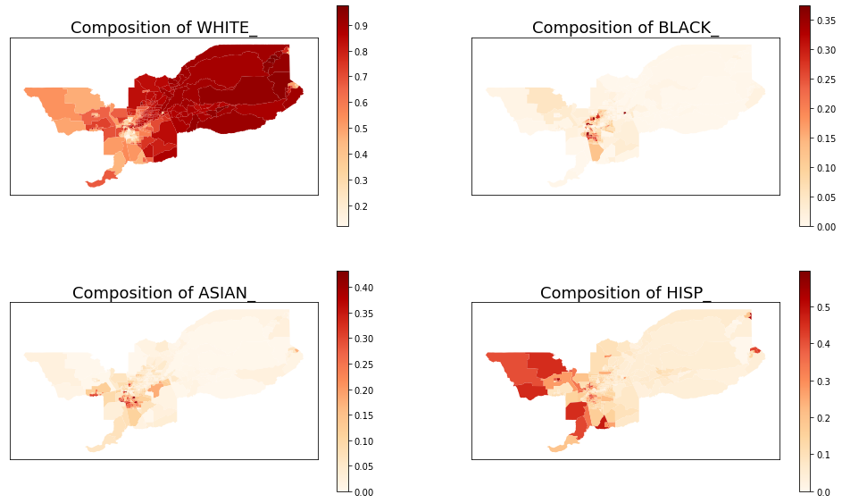
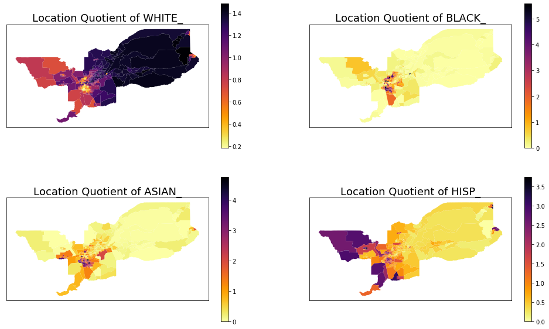
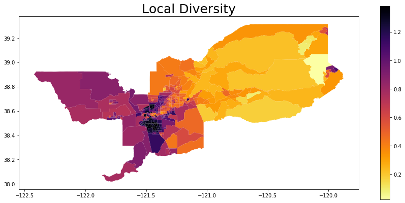
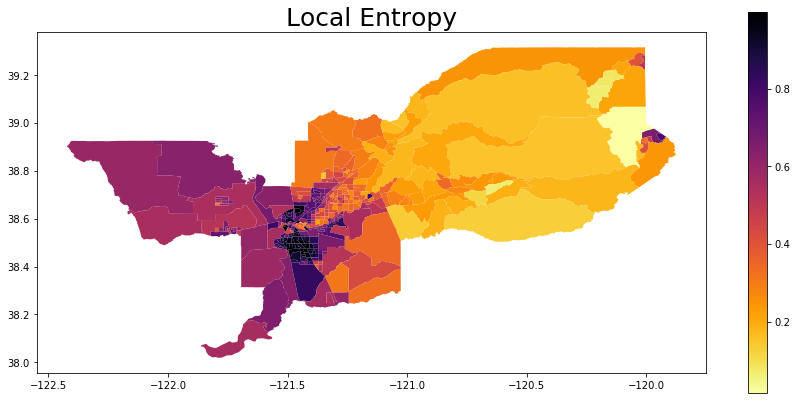
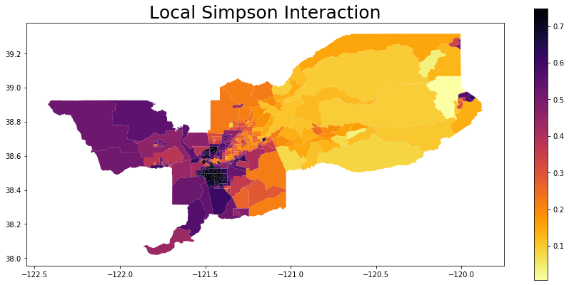
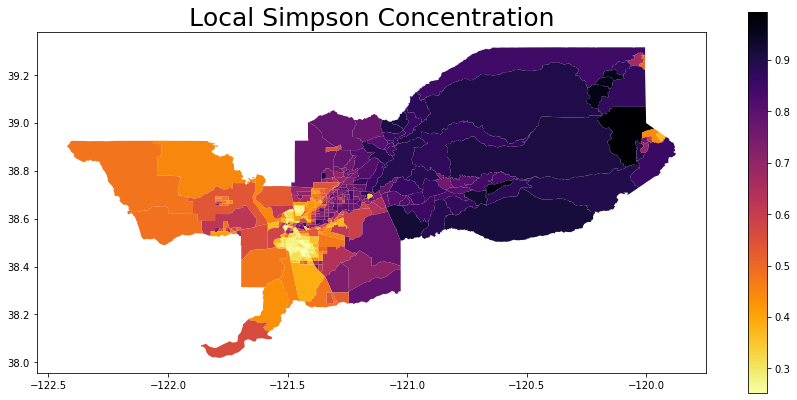
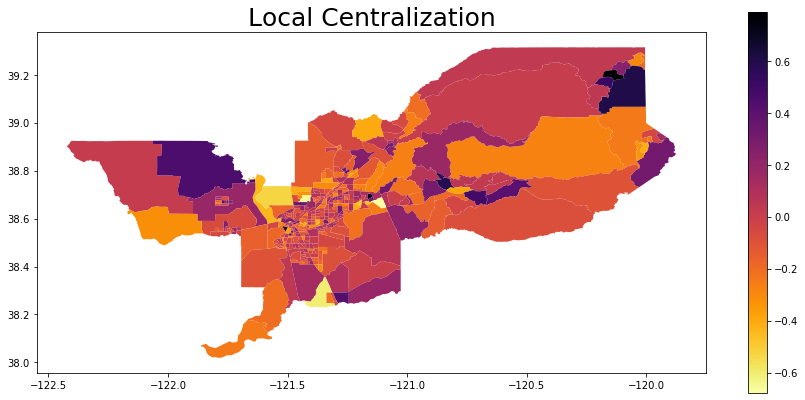

---
redirect_from:
  - "/explore/segregation/local-measures-example"
interact_link: content/explore/segregation/local_measures_example.ipynb
kernel_name: python3
has_widgets: false
title: 'local_measures_example'
prev_page:
  url: /explore/segregation/spatial_examples
  title: 'spatial_examples'
next_page:
  url: /explore/inequality/intro
  title: 'inequality'
comment: "***PROGRAMMATICALLY GENERATED, DO NOT EDIT. SEE ORIGINAL FILES IN /content***"
---


# Local Measures of segregation


This is an example notebook of functionalities for local measures of the *segregation* module. Firstly, we need to import the packages and functions we need:


<div markdown="1" class="cell code_cell">
<div class="input_area" markdown="1">
```python
import pysal.lib
from pysal.explore import segregation
import geopandas as gpd
import matplotlib.pyplot as plt

from pysal.explore.segregation.local import MultiLocationQuotient, MultiLocalDiversity, MultiLocalEntropy, MultiLocalSimpsonInteraction, MultiLocalSimpsonConcentration, LocalRelativeCentralization

```
</div>

</div>


Then it's time to load some data to estimate segregation. We use the data of 2000 Census Tract Data for the metropolitan area of Sacramento, CA, USA. 

We use a geopandas dataframe available in PySAL examples repository.

For more information about the data: https://github.com/pysal/pysal.lib/tree/master/pysal.lib/examples/sacramento2


<div markdown="1" class="cell code_cell">
<div class="input_area" markdown="1">
```python
input_df = gpd.read_file(pysal.lib.examples.get_path("sacramentot2.shp"))
input_df.columns

```
</div>

<div class="output_wrapper" markdown="1">
<div class="output_subarea" markdown="1">


{:.output_data_text}
```
Index(['FIPS', 'MSA', 'TOT_POP', 'POP_16', 'POP_65', 'WHITE_', 'BLACK_',
       'ASIAN_', 'HISP_', 'MULTI_RA', 'MALES', 'FEMALES', 'MALE1664',
       'FEM1664', 'EMPL16', 'EMP_AWAY', 'EMP_HOME', 'EMP_29', 'EMP_30',
       'EMP16_2', 'EMP_MALE', 'EMP_FEM', 'OCC_MAN', 'OCC_OFF1', 'OCC_INFO',
       'HH_INC', 'POV_POP', 'POV_TOT', 'HSG_VAL', 'FIPSNO', 'POLYID',
       'geometry'],
      dtype='object')
```


</div>
</div>
</div>


**Important: all classes that start with "Multi_" expects a specific type of input of multigroups since the index will be calculated using many groups.
On the other hand, other classes expects a single group for calculation of the metrics.**


The groups of interest are White, Black, Asian and Hispanic population. Therefore, we create an auxiliary list with only the necessary columns for fitting the index.


<div markdown="1" class="cell code_cell">
<div class="input_area" markdown="1">
```python
groups_list = ['WHITE_', 'BLACK_', 'ASIAN_','HISP_']

```
</div>

</div>


We also can plot the spatial distribution of the composition of each of these groups over the tracts of Sacramento:


<div markdown="1" class="cell code_cell">
<div class="input_area" markdown="1">
```python
for i in range(len(groups_list)):
    input_df['comp_' + groups_list[i]] = input_df[groups_list[i]] / input_df['TOT_POP']

fig, axes = plt.subplots(ncols = 2, nrows = 2, figsize = (17, 10))


input_df.plot(column = 'comp_' + groups_list[0],
              cmap = 'OrRd',
              legend = True, ax = axes[0,0])
axes[0,0].set_title('Composition of ' + groups_list[0], fontsize = 18)
axes[0,0].set_xticks([])
axes[0,0].set_yticks([])
axes[0,0].set_facecolor('white')


input_df.plot(column = 'comp_' + groups_list[1],
              cmap = 'OrRd',
              legend = True, ax = axes[0,1])
axes[0,1].set_title('Composition of ' + groups_list[1], fontsize = 18)
axes[0,1].set_xticks([])
axes[0,1].set_yticks([])
axes[0,1].set_facecolor('white')


input_df.plot(column = 'comp_' + groups_list[2],
              cmap = 'OrRd',
              legend = True, ax = axes[1,0])
axes[1,0].set_title('Composition of ' + groups_list[2], fontsize = 18)
axes[1,0].set_xticks([])
axes[1,0].set_yticks([])
axes[1,0].set_facecolor('white')

input_df.plot(column = 'comp_' + groups_list[3],
              cmap = 'OrRd',
              legend = True, ax = axes[1,1])
axes[1,1].set_title('Composition of ' + groups_list[3], fontsize = 18)
axes[1,1].set_xticks([])
axes[1,1].set_yticks([])
axes[1,1].set_facecolor('white')

```
</div>

<div class="output_wrapper" markdown="1">
<div class="output_subarea" markdown="1">

{:.output_png}


</div>
</div>
</div>


# Location Quotient (LQ)


<div markdown="1" class="cell code_cell">
<div class="input_area" markdown="1">
```python
index = MultiLocationQuotient(input_df, groups_list)
index.statistics

```
</div>

<div class="output_wrapper" markdown="1">
<div class="output_subarea" markdown="1">


{:.output_data_text}
```
array([[1.36543221, 0.07478049, 0.16245651, 0.38088068],
       [1.18002164, 0.        , 0.14836683, 1.18544649],
       [0.68072696, 0.03534425, 0.        , 3.31119136],
       ...,
       [0.99613635, 0.10550213, 0.20912883, 1.86164972],
       [0.92802194, 0.24709231, 0.47460486, 1.92804399],
       [1.06821891, 0.07674888, 0.70759745, 1.29220137]])
```


</div>
</div>
</div>


Important to note that column k has the Location Quotient (LQ) of position k in groups. Therefore, the LQ of the first unit of `'WHITE_'` is `1.36543221` and, for example the LQ of `'BLACK_'` of the last spatial unit is `0.07674888`. In addition, in this case we can plot the LQ of every group in the dataset similarly the way we did previously with the composition:


<div markdown="1" class="cell code_cell">
<div class="input_area" markdown="1">
```python
for i in range(len(groups_list)):
    input_df['LQ_' + groups_list[i]] = index.statistics[:,i]

fig, axes = plt.subplots(ncols = 2, nrows = 2, figsize = (17, 10))


input_df.plot(column = 'LQ_' + groups_list[0],
              cmap = 'inferno_r',
              legend = True, ax = axes[0,0])
axes[0,0].set_title('Location Quotient of ' + groups_list[0], fontsize = 18)
axes[0,0].set_xticks([])
axes[0,0].set_yticks([])
axes[0,0].set_facecolor('white')


input_df.plot(column = 'LQ_' + groups_list[1],
              cmap = 'inferno_r',
              legend = True, ax = axes[0,1])
axes[0,1].set_title('Location Quotient of ' + groups_list[1], fontsize = 18)
axes[0,1].set_xticks([])
axes[0,1].set_yticks([])
axes[0,1].set_facecolor('white')


input_df.plot(column = 'LQ_' + groups_list[2],
              cmap = 'inferno_r',
              legend = True, ax = axes[1,0])
axes[1,0].set_title('Location Quotient of ' + groups_list[2], fontsize = 18)
axes[1,0].set_xticks([])
axes[1,0].set_yticks([])
axes[1,0].set_facecolor('white')

input_df.plot(column = 'LQ_' + groups_list[3],
              cmap = 'inferno_r',
              legend = True, ax = axes[1,1])
axes[1,1].set_title('Location Quotient of ' + groups_list[3], fontsize = 18)
axes[1,1].set_xticks([])
axes[1,1].set_yticks([])
axes[1,1].set_facecolor('white')

```
</div>

<div class="output_wrapper" markdown="1">
<div class="output_subarea" markdown="1">

{:.output_png}


</div>
</div>
</div>


# Local Diversity


<div markdown="1" class="cell code_cell">
<div class="input_area" markdown="1">
```python
index = MultiLocalDiversity(input_df, groups_list)
index.statistics[0:10] # Values of first 10 units

```
</div>

<div class="output_wrapper" markdown="1">
<div class="output_subarea" markdown="1">


{:.output_data_text}
```
array([0.34332326, 0.56109229, 0.70563225, 0.29713472, 0.22386084,
       0.29742517, 0.12322789, 0.11274579, 0.09402405, 0.25129616])
```


</div>
</div>
</div>


<div markdown="1" class="cell code_cell">
<div class="input_area" markdown="1">
```python
input_df['Local_Diversity'] = index.statistics
input_df.head()
ax = input_df.plot(column = 'Local_Diversity', cmap = 'inferno_r', legend = True, figsize = (15,7))
ax.set_title("Local Diversity", fontsize = 25)

```
</div>

<div class="output_wrapper" markdown="1">
<div class="output_subarea" markdown="1">


{:.output_data_text}
```
Text(0.5, 1, 'Local Diversity')
```


</div>
</div>
<div class="output_wrapper" markdown="1">
<div class="output_subarea" markdown="1">

{:.output_png}


</div>
</div>
</div>


# Local Entropy


<div markdown="1" class="cell code_cell">
<div class="input_area" markdown="1">
```python
index = MultiLocalEntropy(input_df, groups_list)
index.statistics[0:10] # Values of first 10 units

```
</div>

<div class="output_wrapper" markdown="1">
<div class="output_subarea" markdown="1">


{:.output_data_text}
```
array([0.24765538, 0.40474253, 0.50900607, 0.21433739, 0.16148146,
       0.21454691, 0.08889013, 0.08132889, 0.06782401, 0.18127186])
```


</div>
</div>
</div>


<div markdown="1" class="cell code_cell">
<div class="input_area" markdown="1">
```python
input_df['Local_Entropy'] = index.statistics
input_df.head()
ax = input_df.plot(column = 'Local_Entropy', cmap = 'inferno_r', legend = True, figsize = (15,7))
ax.set_title("Local Entropy", fontsize = 25)

```
</div>

<div class="output_wrapper" markdown="1">
<div class="output_subarea" markdown="1">


{:.output_data_text}
```
Text(0.5, 1, 'Local Entropy')
```


</div>
</div>
<div class="output_wrapper" markdown="1">
<div class="output_subarea" markdown="1">

{:.output_png}


</div>
</div>
</div>


# Local Simpson Interaction


<div markdown="1" class="cell code_cell">
<div class="input_area" markdown="1">
```python
index = MultiLocalSimpsonInteraction(input_df, groups_list)
index.statistics[0:10] # Values of first 10 units

```
</div>

<div class="output_wrapper" markdown="1">
<div class="output_subarea" markdown="1">


{:.output_data_text}
```
array([0.15435993, 0.33391595, 0.49909747, 0.1299449 , 0.09805056,
       0.13128178, 0.04447356, 0.0398933 , 0.03723054, 0.11758548])
```


</div>
</div>
</div>


<div markdown="1" class="cell code_cell">
<div class="input_area" markdown="1">
```python
input_df['Local_Simpson_Interaction'] = index.statistics
input_df.head()
ax = input_df.plot(column = 'Local_Simpson_Interaction', cmap = 'inferno_r', legend = True, figsize = (15,7))
ax.set_title("Local Simpson Interaction", fontsize = 25)

```
</div>

<div class="output_wrapper" markdown="1">
<div class="output_subarea" markdown="1">


{:.output_data_text}
```
Text(0.5, 1, 'Local Simpson Interaction')
```


</div>
</div>
<div class="output_wrapper" markdown="1">
<div class="output_subarea" markdown="1">

{:.output_png}


</div>
</div>
</div>


# Local Simpson Concentration


<div markdown="1" class="cell code_cell">
<div class="input_area" markdown="1">
```python
index = MultiLocalSimpsonConcentration(input_df, groups_list)
index.statistics[0:10] # Values of first 10 units

```
</div>

<div class="output_wrapper" markdown="1">
<div class="output_subarea" markdown="1">


{:.output_data_text}
```
array([0.84564007, 0.66608405, 0.50090253, 0.8700551 , 0.90194944,
       0.86871822, 0.95552644, 0.9601067 , 0.96276946, 0.88241452])
```


</div>
</div>
</div>


<div markdown="1" class="cell code_cell">
<div class="input_area" markdown="1">
```python
input_df['Local_Simpson_Concentration'] = index.statistics
input_df.head()
ax = input_df.plot(column = 'Local_Simpson_Concentration', cmap = 'inferno_r', legend = True, figsize = (15,7))
ax.set_title("Local Simpson Concentration", fontsize = 25)

```
</div>

<div class="output_wrapper" markdown="1">
<div class="output_subarea" markdown="1">


{:.output_data_text}
```
Text(0.5, 1, 'Local Simpson Concentration')
```


</div>
</div>
<div class="output_wrapper" markdown="1">
<div class="output_subarea" markdown="1">

{:.output_png}


</div>
</div>
</div>


# Local Centralization


Let's assume we want to calculate the Local Centralization to the group `'BLACK_'`:


<div markdown="1" class="cell code_cell">
<div class="input_area" markdown="1">
```python
index = LocalRelativeCentralization(input_df, 'BLACK_', 'TOT_POP')
index.statistics[0:10] # Values of first 10 units

```
</div>

<div class="output_wrapper" markdown="1">
<div class="output_subarea" markdown="1">


{:.output_data_text}
```
array([ 0.03443055, -0.29063264, -0.19110976,  0.24978919,  0.01252249,
        0.61152941,  0.78917647,  0.53129412,  0.04436346, -0.20216325])
```


</div>
</div>
</div>


<div markdown="1" class="cell code_cell">
<div class="input_area" markdown="1">
```python
input_df['Local_Centralization'] = index.statistics
input_df.head()
ax = input_df.plot(column = 'Local_Centralization', cmap = 'inferno_r', legend = True, figsize = (15,7))
ax.set_title("Local Centralization", fontsize = 25)

```
</div>

<div class="output_wrapper" markdown="1">
<div class="output_subarea" markdown="1">


{:.output_data_text}
```
Text(0.5, 1, 'Local Centralization')
```


</div>
</div>
<div class="output_wrapper" markdown="1">
<div class="output_subarea" markdown="1">

{:.output_png}


</div>
</div>
</div>

