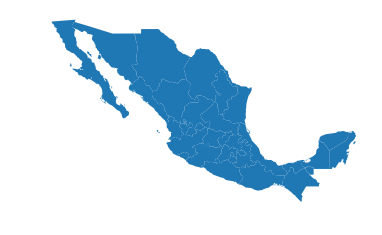
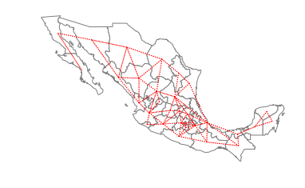
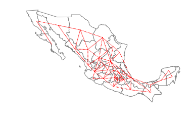
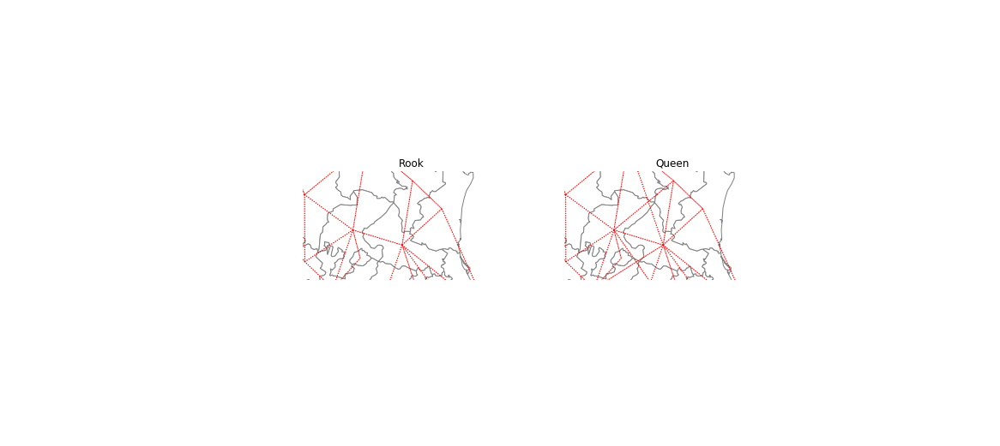
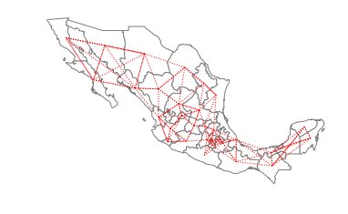
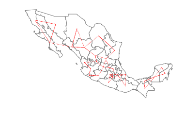
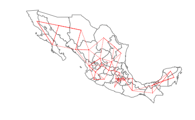
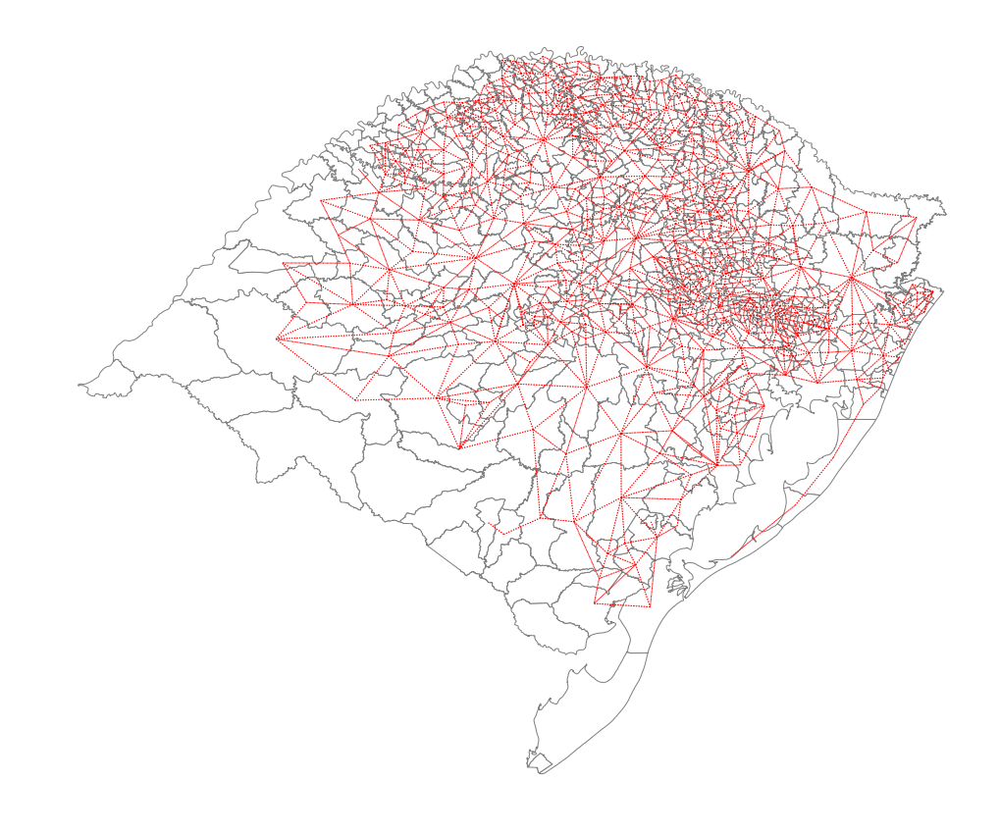
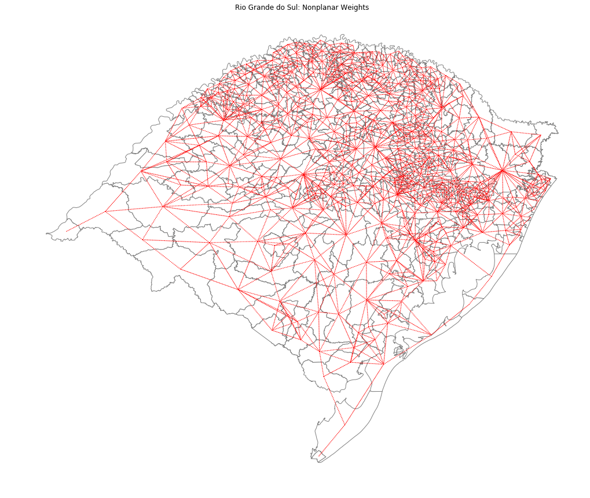

<div markdown="1" class="cell code_cell">
<div class="input_area" markdown="1">
```python
import sys
import os

```
</div>

</div>


<div markdown="1" class="cell code_cell">
<div class="input_area" markdown="1">
```python
sys.path.append(os.path.abspath('..'))
import libpysal

```
</div>

</div>


<div markdown="1" class="cell code_cell">
<div class="input_area" markdown="1">
```python
libpysal.examples.available()

```
</div>

<div class="output_wrapper" markdown="1">
<div class="output_subarea" markdown="1">


{:.output_data_text}
```
['georgia',
 '__pycache__',
 'tests',
 'newHaven',
 'Polygon_Holes',
 'nat',
 'Polygon',
 '10740',
 'berlin',
 'rio_grande_do_sul',
 'sids2',
 'sacramento2',
 'burkitt',
 'arcgis',
 'calemp',
 'stl',
 'virginia',
 'geodanet',
 'desmith',
 'book',
 'nyc_bikes',
 'Line',
 'south',
 'snow_maps',
 'Point',
 'street_net_pts',
 'guerry',
 '__pycache__',
 'baltim',
 'networks',
 'us_income',
 'taz',
 'columbus',
 'tokyo',
 'mexico',
 '__pycache__',
 'chicago',
 'wmat',
 'juvenile',
 'clearwater']
```


</div>
</div>
</div>


<div markdown="1" class="cell code_cell">
<div class="input_area" markdown="1">
```python
libpysal.examples.explain('mexico')

```
</div>

<div class="output_wrapper" markdown="1">
<div class="output_subarea" markdown="1">


{:.output_data_text}
```
{'name': 'mexico',
 'description': 'Decennial per capita incomes of Mexican states 1940-2000',
 'explanation': ['* mexico.csv: attribute data. (n=32, k=13)',
  '* mexico.gal: spatial weights in GAL format.',
  '* mexicojoin.shp: Polygon shapefile. (n=32)',
  'Data used in Rey, S.J. and M.L. Sastre Gutierrez. (2010) "Interregional inequality dynamics in Mexico." Spatial Economic Analysis, 5: 277-298.']}
```


</div>
</div>
</div>


## Weights from GeoDataFrames


<div markdown="1" class="cell code_cell">
<div class="input_area" markdown="1">
```python
import geopandas
pth = libpysal.examples.get_path("mexicojoin.shp")
gdf = geopandas.read_file(pth)

from libpysal.weights import Queen, Rook, KNN

```
</div>

</div>


<div markdown="1" class="cell code_cell">
<div class="input_area" markdown="1">
```python
%matplotlib inline
import matplotlib.pyplot as plt


```
</div>

</div>


<div markdown="1" class="cell code_cell">
<div class="input_area" markdown="1">
```python
ax = gdf.plot()
ax.set_axis_off()

```
</div>

<div class="output_wrapper" markdown="1">
<div class="output_subarea" markdown="1">

{:.output_png}


</div>
</div>
</div>


### Contiguity Weights

The first set of spatial weights we illustrate use notions of contiguity to define neighboring observations. **Rook** neighbors are those states that share an edge on their respective borders:


<div markdown="1" class="cell code_cell">
<div class="input_area" markdown="1">
```python
w_rook = Rook.from_dataframe(gdf)

```
</div>

</div>


<div markdown="1" class="cell code_cell">
<div class="input_area" markdown="1">
```python
w_rook.n

```
</div>

<div class="output_wrapper" markdown="1">
<div class="output_subarea" markdown="1">


{:.output_data_text}
```
32
```


</div>
</div>
</div>


<div markdown="1" class="cell code_cell">
<div class="input_area" markdown="1">
```python
w_rook.pct_nonzero

```
</div>

<div class="output_wrapper" markdown="1">
<div class="output_subarea" markdown="1">


{:.output_data_text}
```
12.6953125
```


</div>
</div>
</div>


<div markdown="1" class="cell code_cell">
<div class="input_area" markdown="1">
```python
ax = gdf.plot(edgecolor='grey', facecolor='w')
f,ax = w_rook.plot(gdf, ax=ax, 
        edge_kws=dict(color='r', linestyle=':', linewidth=1),
        node_kws=dict(marker=''))
ax.set_axis_off()

```
</div>

<div class="output_wrapper" markdown="1">
<div class="output_subarea" markdown="1">

{:.output_png}


</div>
</div>
</div>


<div markdown="1" class="cell code_cell">
<div class="input_area" markdown="1">
```python
gdf.head()

```
</div>

<div class="output_wrapper" markdown="1">
<div class="output_subarea" markdown="1">


<div markdown="0" class="output output_html">
<div>
<style scoped>
    .dataframe tbody tr th:only-of-type {
        vertical-align: middle;
    }

    .dataframe tbody tr th {
        vertical-align: top;
    }

    .dataframe thead th {
        text-align: right;
    }
</style>
<table border="1" class="dataframe">
  <thead>
    <tr style="text-align: right;">
      <th></th>
      <th>POLY_ID</th>
      <th>AREA</th>
      <th>CODE</th>
      <th>NAME</th>
      <th>PERIMETER</th>
      <th>ACRES</th>
      <th>HECTARES</th>
      <th>PCGDP1940</th>
      <th>PCGDP1950</th>
      <th>PCGDP1960</th>
      <th>...</th>
      <th>GR9000</th>
      <th>LPCGDP40</th>
      <th>LPCGDP50</th>
      <th>LPCGDP60</th>
      <th>LPCGDP70</th>
      <th>LPCGDP80</th>
      <th>LPCGDP90</th>
      <th>LPCGDP00</th>
      <th>TEST</th>
      <th>geometry</th>
    </tr>
  </thead>
  <tbody>
    <tr>
      <th>0</th>
      <td>1</td>
      <td>7.252751e+10</td>
      <td>MX02</td>
      <td>Baja California Norte</td>
      <td>2040312.385</td>
      <td>1.792187e+07</td>
      <td>7252751.376</td>
      <td>22361.0</td>
      <td>20977.0</td>
      <td>17865.0</td>
      <td>...</td>
      <td>0.05</td>
      <td>4.35</td>
      <td>4.32</td>
      <td>4.25</td>
      <td>4.40</td>
      <td>4.47</td>
      <td>4.43</td>
      <td>4.48</td>
      <td>1.0</td>
      <td>(POLYGON ((-113.1397171020508 29.0177764892578...</td>
    </tr>
    <tr>
      <th>1</th>
      <td>2</td>
      <td>7.225988e+10</td>
      <td>MX03</td>
      <td>Baja California Sur</td>
      <td>2912880.772</td>
      <td>1.785573e+07</td>
      <td>7225987.769</td>
      <td>9573.0</td>
      <td>16013.0</td>
      <td>16707.0</td>
      <td>...</td>
      <td>0.00</td>
      <td>3.98</td>
      <td>4.20</td>
      <td>4.22</td>
      <td>4.39</td>
      <td>4.46</td>
      <td>4.41</td>
      <td>4.42</td>
      <td>2.0</td>
      <td>(POLYGON ((-111.2061233520508 25.8027763366699...</td>
    </tr>
    <tr>
      <th>2</th>
      <td>3</td>
      <td>2.731957e+10</td>
      <td>MX18</td>
      <td>Nayarit</td>
      <td>1034770.341</td>
      <td>6.750785e+06</td>
      <td>2731956.859</td>
      <td>4836.0</td>
      <td>7515.0</td>
      <td>7621.0</td>
      <td>...</td>
      <td>-0.05</td>
      <td>3.68</td>
      <td>3.88</td>
      <td>3.88</td>
      <td>4.04</td>
      <td>4.13</td>
      <td>4.11</td>
      <td>4.06</td>
      <td>3.0</td>
      <td>(POLYGON ((-106.6210784912109 21.5653114318847...</td>
    </tr>
    <tr>
      <th>3</th>
      <td>4</td>
      <td>7.961008e+10</td>
      <td>MX14</td>
      <td>Jalisco</td>
      <td>2324727.436</td>
      <td>1.967200e+07</td>
      <td>7961008.285</td>
      <td>5309.0</td>
      <td>8232.0</td>
      <td>9953.0</td>
      <td>...</td>
      <td>0.03</td>
      <td>3.73</td>
      <td>3.92</td>
      <td>4.00</td>
      <td>4.21</td>
      <td>4.32</td>
      <td>4.30</td>
      <td>4.33</td>
      <td>4.0</td>
      <td>POLYGON ((-101.52490234375 21.85663986206055, ...</td>
    </tr>
    <tr>
      <th>4</th>
      <td>5</td>
      <td>5.467030e+09</td>
      <td>MX01</td>
      <td>Aguascalientes</td>
      <td>313895.530</td>
      <td>1.350927e+06</td>
      <td>546702.985</td>
      <td>10384.0</td>
      <td>6234.0</td>
      <td>8714.0</td>
      <td>...</td>
      <td>0.13</td>
      <td>4.02</td>
      <td>3.79</td>
      <td>3.94</td>
      <td>4.21</td>
      <td>4.32</td>
      <td>4.32</td>
      <td>4.44</td>
      <td>5.0</td>
      <td>POLYGON ((-101.8461990356445 22.01176071166992...</td>
    </tr>
  </tbody>
</table>
<p>5 rows × 35 columns</p>
</div>
</div>


</div>
</div>
</div>


<div markdown="1" class="cell code_cell">
<div class="input_area" markdown="1">
```python
w_rook.neighbors[0] # the first location has two neighbors at locations 1 and 22

```
</div>

<div class="output_wrapper" markdown="1">
<div class="output_subarea" markdown="1">


{:.output_data_text}
```
[1, 22]
```


</div>
</div>
</div>


<div markdown="1" class="cell code_cell">
<div class="input_area" markdown="1">
```python
gdf['NAME'][[0, 1,22]]

```
</div>

<div class="output_wrapper" markdown="1">
<div class="output_subarea" markdown="1">


{:.output_data_text}
```
0     Baja California Norte
1       Baja California Sur
22                   Sonora
Name: NAME, dtype: object
```


</div>
</div>
</div>


So, Baja California Norte has 2 rook neighbors: Baja California Sur and Sonora.


**Queen** neighbors are based on a more inclusive condition that requires only a shared vertex between two states:


<div markdown="1" class="cell code_cell">
<div class="input_area" markdown="1">
```python
w_queen = Queen.from_dataframe(gdf)

```
</div>

</div>


<div markdown="1" class="cell code_cell">
<div class="input_area" markdown="1">
```python
w_queen.n == w_rook.n

```
</div>

<div class="output_wrapper" markdown="1">
<div class="output_subarea" markdown="1">


{:.output_data_text}
```
True
```


</div>
</div>
</div>


<div markdown="1" class="cell code_cell">
<div class="input_area" markdown="1">
```python
(w_queen.pct_nonzero > w_rook.pct_nonzero) == (w_queen.n == w_rook.n)

```
</div>

<div class="output_wrapper" markdown="1">
<div class="output_subarea" markdown="1">


{:.output_data_text}
```
True
```


</div>
</div>
</div>


<div markdown="1" class="cell code_cell">
<div class="input_area" markdown="1">
```python
ax = gdf.plot(edgecolor='grey', facecolor='w')
f,ax = w_queen.plot(gdf, ax=ax, 
        edge_kws=dict(color='r', linestyle=':', linewidth=1),
        node_kws=dict(marker=''))
ax.set_axis_off()

```
</div>

<div class="output_wrapper" markdown="1">
<div class="output_subarea" markdown="1">

{:.output_png}


</div>
</div>
</div>


<div markdown="1" class="cell code_cell">
<div class="input_area" markdown="1">
```python
w_queen.histogram

```
</div>

<div class="output_wrapper" markdown="1">
<div class="output_subarea" markdown="1">


{:.output_data_text}
```
[(1, 1), (2, 6), (3, 6), (4, 6), (5, 5), (6, 2), (7, 3), (8, 2), (9, 1)]
```


</div>
</div>
</div>


<div markdown="1" class="cell code_cell">
<div class="input_area" markdown="1">
```python
w_rook.histogram

```
</div>

<div class="output_wrapper" markdown="1">
<div class="output_subarea" markdown="1">


{:.output_data_text}
```
[(1, 1), (2, 6), (3, 7), (4, 7), (5, 3), (6, 4), (7, 3), (8, 1)]
```


</div>
</div>
</div>


<div markdown="1" class="cell code_cell">
<div class="input_area" markdown="1">
```python
c9 = [idx for idx,c in w_queen.cardinalities.items() if c==9]

```
</div>

</div>


<div markdown="1" class="cell code_cell">
<div class="input_area" markdown="1">
```python
gdf['NAME'][c9]

```
</div>

<div class="output_wrapper" markdown="1">
<div class="output_subarea" markdown="1">


{:.output_data_text}
```
28    San Luis Potosi
Name: NAME, dtype: object
```


</div>
</div>
</div>


<div markdown="1" class="cell code_cell">
<div class="input_area" markdown="1">
```python
w_rook.neighbors[28]

```
</div>

<div class="output_wrapper" markdown="1">
<div class="output_subarea" markdown="1">


{:.output_data_text}
```
[5, 6, 7, 27, 29, 30, 31]
```


</div>
</div>
</div>


<div markdown="1" class="cell code_cell">
<div class="input_area" markdown="1">
```python
w_queen.neighbors[28]

```
</div>

<div class="output_wrapper" markdown="1">
<div class="output_subarea" markdown="1">


{:.output_data_text}
```
[3, 5, 6, 7, 24, 27, 29, 30, 31]
```


</div>
</div>
</div>


<div markdown="1" class="cell code_cell">
<div class="input_area" markdown="1">
```python
import numpy as np
f,ax = plt.subplots(1,2,figsize=(10, 6), subplot_kw=dict(aspect='equal'))
gdf.plot(edgecolor='grey', facecolor='w', ax=ax[0])
w_rook.plot(gdf, ax=ax[0], 
        edge_kws=dict(color='r', linestyle=':', linewidth=1),
        node_kws=dict(marker=''))
ax[0].set_title('Rook')
ax[0].axis(np.asarray([-105.0, -95.0, 21, 26]))

ax[0].axis('off')
gdf.plot(edgecolor='grey', facecolor='w', ax=ax[1])
w_queen.plot(gdf, ax=ax[1], 
        edge_kws=dict(color='r', linestyle=':', linewidth=1),
        node_kws=dict(marker=''))
ax[1].set_title('Queen')
ax[1].axis('off')
ax[1].axis(np.asarray([-105.0, -95.0, 21, 26]))

```
</div>

<div class="output_wrapper" markdown="1">
<div class="output_subarea" markdown="1">


{:.output_data_text}
```
array([-105.,  -95.,   21.,   26.])
```


</div>
</div>
<div class="output_wrapper" markdown="1">
<div class="output_subarea" markdown="1">

{:.output_png}


</div>
</div>
</div>


<div markdown="1" class="cell code_cell">
<div class="input_area" markdown="1">
```python
w_knn = KNN.from_dataframe(gdf, k=4)

```
</div>

</div>


<div markdown="1" class="cell code_cell">
<div class="input_area" markdown="1">
```python
w_knn.histogram

```
</div>

<div class="output_wrapper" markdown="1">
<div class="output_subarea" markdown="1">


{:.output_data_text}
```
[(4, 32)]
```


</div>
</div>
</div>


<div markdown="1" class="cell code_cell">
<div class="input_area" markdown="1">
```python
ax = gdf.plot(edgecolor='grey', facecolor='w')
f,ax = w_knn.plot(gdf, ax=ax, 
        edge_kws=dict(color='r', linestyle=':', linewidth=1),
        node_kws=dict(marker=''))
ax.set_axis_off()

```
</div>

<div class="output_wrapper" markdown="1">
<div class="output_subarea" markdown="1">

{:.output_png}


</div>
</div>
</div>


## Weights from shapefiles (without geopandas)


<div markdown="1" class="cell code_cell">
<div class="input_area" markdown="1">
```python
pth = libpysal.examples.get_path("mexicojoin.shp")
from libpysal.weights import Queen, Rook, KNN

```
</div>

</div>


<div markdown="1" class="cell code_cell">
<div class="input_area" markdown="1">
```python
w_queen = Queen.from_shapefile(pth)

```
</div>

</div>


<div markdown="1" class="cell code_cell">
<div class="input_area" markdown="1">
```python
w_rook = Rook.from_shapefile(pth)

```
</div>

</div>


<div markdown="1" class="cell code_cell">
<div class="input_area" markdown="1">
```python
w_knn1 = KNN.from_shapefile(pth)

```
</div>

</div>


The warning alerts us to the fact that using a first nearest neighbor criterion to define the neighbors results in a connectivity graph that has more than a single component. In this particular case there are 2 components which can be seen in the following plot:


<div markdown="1" class="cell code_cell">
<div class="input_area" markdown="1">
```python
ax = gdf.plot(edgecolor='grey', facecolor='w')
f,ax = w_knn1.plot(gdf, ax=ax, 
        edge_kws=dict(color='r', linestyle=':', linewidth=1),
        node_kws=dict(marker=''))
ax.set_axis_off()

```
</div>

<div class="output_wrapper" markdown="1">
<div class="output_subarea" markdown="1">

{:.output_png}


</div>
</div>
</div>


The two components are separated in the southern part of the country, with the smaller component to the east and the larger component running through the rest of the country to the west. For certain types of spatial analytical methods, it is necessary to have a adjacency structure that consists of a single component. To ensure this for the case of Mexican states, we can increase the number of nearest neighbors to three:


<div markdown="1" class="cell code_cell">
<div class="input_area" markdown="1">
```python
w_knn3 = KNN.from_shapefile(pth,k=3)

```
</div>

</div>


<div markdown="1" class="cell code_cell">
<div class="input_area" markdown="1">
```python
ax = gdf.plot(edgecolor='grey', facecolor='w')
f,ax = w_knn3.plot(gdf, ax=ax, 
        edge_kws=dict(color='r', linestyle=':', linewidth=1),
        node_kws=dict(marker=''))
ax.set_axis_off()

```
</div>

<div class="output_wrapper" markdown="1">
<div class="output_subarea" markdown="1">

{:.output_png}


</div>
</div>
</div>


## Lattice Weights


<div markdown="1" class="cell code_cell">
<div class="input_area" markdown="1">
```python
from libpysal.weights import lat2W

```
</div>

</div>


<div markdown="1" class="cell code_cell">
<div class="input_area" markdown="1">
```python
w = lat2W(4,3)

```
</div>

</div>


<div markdown="1" class="cell code_cell">
<div class="input_area" markdown="1">
```python
w.n

```
</div>

<div class="output_wrapper" markdown="1">
<div class="output_subarea" markdown="1">


{:.output_data_text}
```
12
```


</div>
</div>
</div>


<div markdown="1" class="cell code_cell">
<div class="input_area" markdown="1">
```python
w.pct_nonzero

```
</div>

<div class="output_wrapper" markdown="1">
<div class="output_subarea" markdown="1">


{:.output_data_text}
```
23.61111111111111
```


</div>
</div>
</div>


<div markdown="1" class="cell code_cell">
<div class="input_area" markdown="1">
```python
w.neighbors

```
</div>

<div class="output_wrapper" markdown="1">
<div class="output_subarea" markdown="1">


{:.output_data_text}
```
{0: [3, 1],
 3: [0, 6, 4],
 1: [0, 4, 2],
 4: [1, 3, 7, 5],
 2: [1, 5],
 5: [2, 4, 8],
 6: [3, 9, 7],
 7: [4, 6, 10, 8],
 8: [5, 7, 11],
 9: [6, 10],
 10: [7, 9, 11],
 11: [8, 10]}
```


</div>
</div>
</div>


## Handling nonplanar geometries


<div markdown="1" class="cell code_cell">
<div class="input_area" markdown="1">
```python
rs = libpysal.examples.get_path('map_RS_BR.shp')

```
</div>

</div>


<div markdown="1" class="cell code_cell">
<div class="input_area" markdown="1">
```python
import geopandas as gpd

```
</div>

</div>


<div markdown="1" class="cell code_cell">
<div class="input_area" markdown="1">
```python
rs_df = gpd.read_file(rs)
wq = libpysal.weights.Queen.from_dataframe(rs_df)

```
</div>

</div>


<div markdown="1" class="cell code_cell">
<div class="input_area" markdown="1">
```python
len(wq.islands)

```
</div>

<div class="output_wrapper" markdown="1">
<div class="output_subarea" markdown="1">


{:.output_data_text}
```
29
```


</div>
</div>
</div>


<div markdown="1" class="cell code_cell">
<div class="input_area" markdown="1">
```python
wq[0]

```
</div>

<div class="output_wrapper" markdown="1">
<div class="output_subarea" markdown="1">


{:.output_data_text}
```
{}
```


</div>
</div>
</div>


<div markdown="1" class="cell code_cell">
<div class="input_area" markdown="1">
```python
wf = libpysal.weights.fuzzy_contiguity(rs_df)

```
</div>

</div>


<div markdown="1" class="cell code_cell">
<div class="input_area" markdown="1">
```python
wf.islands

```
</div>

<div class="output_wrapper" markdown="1">
<div class="output_subarea" markdown="1">


{:.output_data_text}
```
[]
```


</div>
</div>
</div>


<div markdown="1" class="cell code_cell">
<div class="input_area" markdown="1">
```python
wf[0]

```
</div>

<div class="output_wrapper" markdown="1">
<div class="output_subarea" markdown="1">


{:.output_data_text}
```
{239: 1.0, 59: 1.0, 152: 1.0, 23: 1.0, 107: 1.0}
```


</div>
</div>
</div>


<div markdown="1" class="cell code_cell">
<div class="input_area" markdown="1">
```python
plt.rcParams["figure.figsize"] = (20,15)
ax = rs_df.plot(edgecolor='grey', facecolor='w')
f,ax = wq.plot(rs_df, ax=ax, 
        edge_kws=dict(color='r', linestyle=':', linewidth=1),
        node_kws=dict(marker=''))

ax.set_axis_off()

```
</div>

<div class="output_wrapper" markdown="1">
<div class="output_subarea" markdown="1">

{:.output_png}


</div>
</div>
</div>


<div markdown="1" class="cell code_cell">
<div class="input_area" markdown="1">
```python

ax = rs_df.plot(edgecolor='grey', facecolor='w')
f,ax = wf.plot(rs_df, ax=ax, 
        edge_kws=dict(color='r', linestyle=':', linewidth=1),
        node_kws=dict(marker=''))
ax.set_title('Rio Grande do Sul: Nonplanar Weights')
ax.set_axis_off()
plt.savefig('rioGrandeDoSul.png')


```
</div>

<div class="output_wrapper" markdown="1">
<div class="output_subarea" markdown="1">

{:.output_png}


</div>
</div>
</div>

