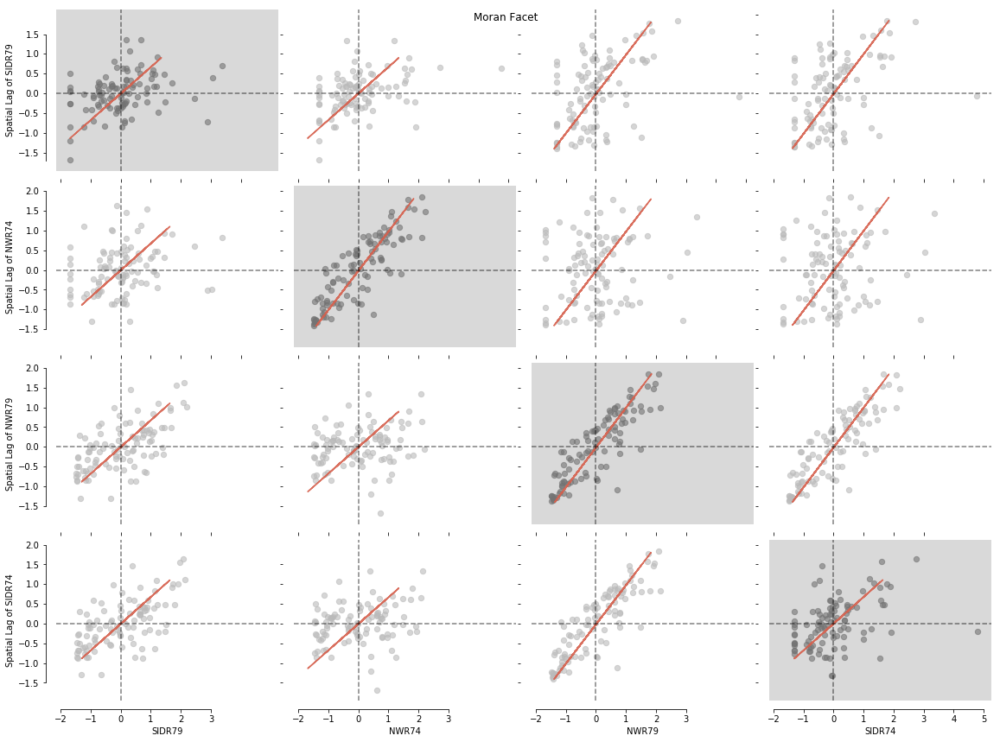

---
redirect_from:
  - "/viz/splot/esda-moran-matrix-viz"
interact_link: content/viz/splot/esda_moran_matrix_viz.ipynb
title: 'esda_moran_matrix_viz'
prev_page:
  url: /viz/splot/esda_morans_viz
  title: 'esda_morans_viz'
next_page:
  url: /viz/splot/giddy_space_time
  title: 'giddy_space_time'
comment: "***PROGRAMMATICALLY GENERATED, DO NOT EDIT. SEE ORIGINAL FILES IN /content***"
---

# Visualising the `esda` Moran Matrix with `splot`

`esda.moran.Moran_BV_matrix` offers you a tool to assess the relationship between multiple input variables over space. `Moran_BV_matrix` returns a dictionary of `Moran_BV` objects which can be displayed and further analysed. In case you are not familiar with Moran Statistics, have a look at `splot`'s `esda_morans_viz.ipynb` notebook. 

## Contents

* Needed imports
* Example 1: Use a list as input
* Example 2: Use a gdf as input

## Imports


{:.input_area}
```python
from libpysal.weights.contiguity import Queen
from libpysal import examples
import libpysal as lp
import geopandas as gpd
import pandas as pd
import matplotlib.pyplot as plt
import matplotlib
import numpy as np
% matplotlib inline
```


## Example 1: define your varnames in a list

There are generally two ways in which a `Moran_BV_matrix` and a `splot.esda.moran_facet` can be generated. The first of the two options is to use `np.arrays` of variables and additionally a list of names describing each variable. In this example, we know that we would like to examine all values in the columns `varnames = ['SIDR74',  'SIDR79',  'NWR74',  'NWR79']` and can pass in a list of column names. From these names we can create separate `np.arrays` containign the values of each individual variable/ column with `vars = [np.array(f.by_col[var]) for var in varnames]`:


{:.input_area}
```python
f = gpd.read_file(examples.get_path("sids2.dbf"))

varnames = ['SIDR74',  'SIDR79',  'NWR74',  'NWR79']
varnames
```


{:.output_data_text}
```
['SIDR74', 'SIDR79', 'NWR74', 'NWR79']
```


{:.input_area}
```python
variable = [np.array(f[variable]) for variable in varnames]
variable[0]
```


{:.output_data_text}
```
array([0.91659 , 0.      , 1.568381, 1.968504, 6.333568, 4.820937,
       0.      , 0.      , 4.132231, 0.620347, 1.932367, 3.596314,
       2.393776, 2.570694, 1.834862, 4.988914, 1.831502, 1.271456,
       0.755858, 2.066116, 1.331558, 0.      , 0.788022, 1.429593,
       0.843313, 1.421157, 2.782534, 4.531722, 1.264223, 2.007528,
       1.989555, 0.      , 2.734482, 1.66251 , 0.      , 1.291156,
       1.104667, 2.614379, 0.966417, 0.8285  , 0.      , 1.452169,
       1.399384, 5.050505, 0.      , 2.569373, 1.570916, 1.215067,
       2.971367, 0.651324, 2.748331, 0.868961, 1.197605, 1.500375,
       0.947867, 0.      , 2.600297, 4.444444, 4.597701, 2.220249,
       4.010695, 2.71166 , 1.588983, 2.055076, 3.610108, 1.749781,
       1.888218, 2.038169, 0.731886, 2.384738, 2.122241, 1.942502,
       0.      , 2.786291, 2.557545, 1.220324, 1.876173, 0.      ,
       1.322314, 1.845018, 1.94742 , 1.865855, 1.730104, 1.021711,
       9.55414 , 4.685408, 0.      , 1.610954, 1.451379, 0.      ,
       2.215406, 3.547672, 2.599032, 3.929522, 2.071251, 4.489338,
       3.257329, 4.477612, 2.171553, 2.292526])
```


Next, we can open a file containing pre calculated spatial weights for "sids2.dbf". In case you don't have spatial weights, check out `libpysal.weights` which will provide you with many options calculating your own.


{:.input_area}
```python
w = lp.io.open(examples.get_path("sids2.gal")).read()
w
```


{:.output_data_text}
```
<libpysal.weights.weights.W at 0x116722ef0>
```


Now we are ready to import and generate our `Moran_BV_matrix`:


{:.input_area}
```python
from esda.moran import Moran_BV_matrix

matrix = Moran_BV_matrix(variable, w, varnames = varnames)
matrix
```


{:.output_data_text}
```
{(0, 1): <esda.moran.Moran_BV at 0x1167142b0>,
 (1, 0): <esda.moran.Moran_BV at 0x116722da0>,
 (0, 2): <esda.moran.Moran_BV at 0x116722e10>,
 (2, 0): <esda.moran.Moran_BV at 0x116722cc0>,
 (0, 3): <esda.moran.Moran_BV at 0x116722dd8>,
 (3, 0): <esda.moran.Moran_BV at 0x1167252e8>,
 (1, 2): <esda.moran.Moran_BV at 0x1167253c8>,
 (2, 1): <esda.moran.Moran_BV at 0x116725390>,
 (1, 3): <esda.moran.Moran_BV at 0x116729908>,
 (3, 1): <esda.moran.Moran_BV at 0x116729b38>,
 (2, 3): <esda.moran.Moran_BV at 0x116729b00>,
 (3, 2): <esda.moran.Moran_BV at 0x116729ac8>}
```


Let's visualise our matrix with `splot.esda.moran_facet()`. You will see Univariate Moran objects with a grey background, surrounded by all possible combinations of your input dataset:


{:.input_area}
```python
from splot.esda import moran_facet

moran_facet(matrix)
plt.show()
```





## Example 2: insert a DataFrame

Additionally, it is possible to generte your `Moran_BV_matrix` and a `moran_facet` using a `pandas` or `geopandas` DataFrame as input. Let's have a look at a simple example examining `columbus.shp` example data:


{:.input_area}
```python
path = examples.get_path('columbus.shp')
gdf = gpd.read_file(path)
```


In order for `moran_facet` to generate sensible results, it is recommended to extract all columns you would specifically like to analyse and generate a new GeoDataFrame:


{:.input_area}
```python
variables2 = gdf[['HOVAL', 'CRIME', 'INC', 'EW']]
variables2.head()
```


<div markdown="0">
<div>
<style scoped>
    .dataframe tbody tr th:only-of-type {
        vertical-align: middle;
    }

    .dataframe tbody tr th {
        vertical-align: top;
    }

    .dataframe thead th {
        text-align: right;
    }
</style>
<table border="1" class="dataframe">
  <thead>
    <tr style="text-align: right;">
      <th></th>
      <th>HOVAL</th>
      <th>CRIME</th>
      <th>INC</th>
      <th>EW</th>
    </tr>
  </thead>
  <tbody>
    <tr>
      <th>0</th>
      <td>80.467003</td>
      <td>15.725980</td>
      <td>19.531</td>
      <td>1.0</td>
    </tr>
    <tr>
      <th>1</th>
      <td>44.567001</td>
      <td>18.801754</td>
      <td>21.232</td>
      <td>0.0</td>
    </tr>
    <tr>
      <th>2</th>
      <td>26.350000</td>
      <td>30.626781</td>
      <td>15.956</td>
      <td>1.0</td>
    </tr>
    <tr>
      <th>3</th>
      <td>33.200001</td>
      <td>32.387760</td>
      <td>4.477</td>
      <td>0.0</td>
    </tr>
    <tr>
      <th>4</th>
      <td>23.225000</td>
      <td>50.731510</td>
      <td>11.252</td>
      <td>1.0</td>
    </tr>
  </tbody>
</table>
</div>
</div>


{:.input_area}
```python
variables2.shape
```


{:.output_data_text}
```
(49, 4)
```


We will now generate our own spatial weights leveraging `libpysal` and create a second `matrix2` from our GeoDataFrame. Note that there is no list of `varnames` needed, this list will be automatically extracted from teh first row of your `gdf`:


{:.input_area}
```python
w2 = Queen.from_shapefile(path)
w2
```


{:.output_data_text}
```
<libpysal.weights.contiguity.Queen at 0x11986bda0>
```


{:.input_area}
```python
matrix2 = Moran_BV_matrix(variables2, w2)
matrix2
```


{:.output_data_text}
```
{(0, 1): <esda.moran.Moran_BV at 0x11993ba90>,
 (1, 0): <esda.moran.Moran_BV at 0x119887668>,
 (0, 2): <esda.moran.Moran_BV at 0x11993b400>,
 (2, 0): <esda.moran.Moran_BV at 0x11993be80>,
 (0, 3): <esda.moran.Moran_BV at 0x11993b7f0>,
 (3, 0): <esda.moran.Moran_BV at 0x11993beb8>,
 (1, 2): <esda.moran.Moran_BV at 0x11993bc18>,
 (2, 1): <esda.moran.Moran_BV at 0x11993b780>,
 (1, 3): <esda.moran.Moran_BV at 0x11993be10>,
 (3, 1): <esda.moran.Moran_BV at 0x11993b6d8>,
 (2, 3): <esda.moran.Moran_BV at 0x11993b668>,
 (3, 2): <esda.moran.Moran_BV at 0x11993b6a0>}
```


Like in the first example we can now plot our data with a simple `splot` call:


{:.input_area}
```python
moran_facet(matrix)
plt.show()
```


